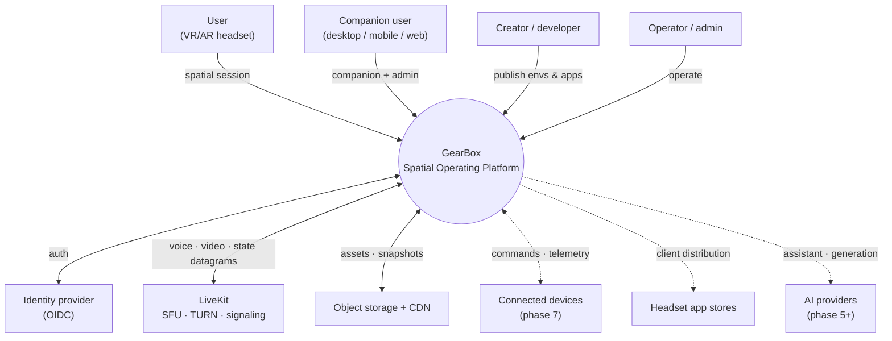
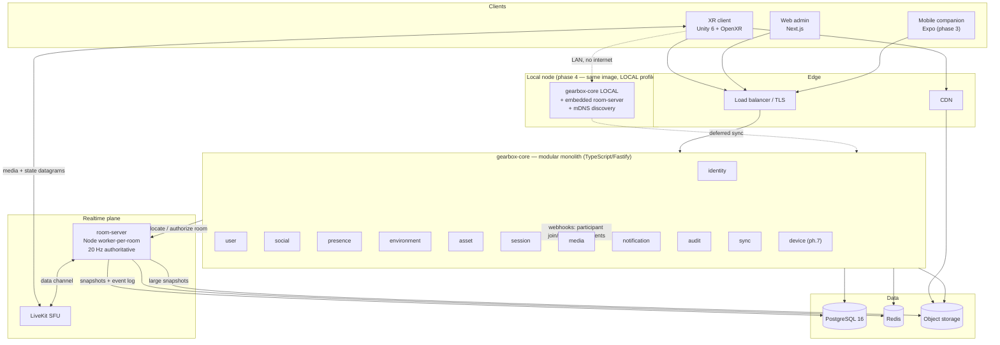
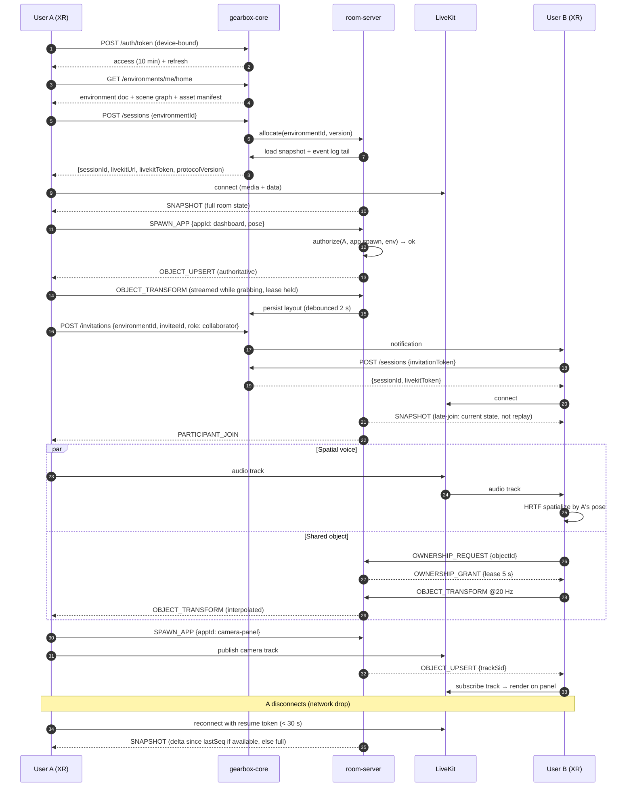
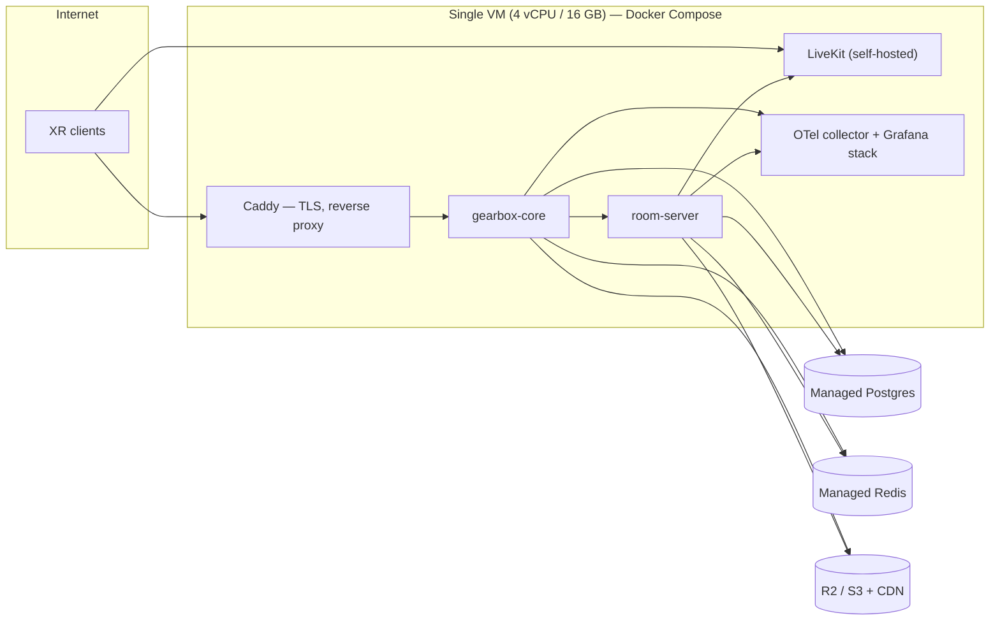

# 03 — System architecture

## 3.1 System context



## 3.2 Container view (MVP)

Everything inside `gearbox-core` is a **module, not a service** ([02](02-stack.md) §2.5).
The room server is separate because it is stateful and has a different lifecycle.



### Why the room server is a separate process

It is the only stateful, latency-critical, hard-to-restart component. Separating it
means: the control plane deploys freely without dropping sessions; room state lives in
one place with one owner; the future Rust port ([02](02-stack.md) §2.4) is a process
swap; and the local node can embed the identical process with a different authority
implementation.

**One room = one `worker_thread`.** Node's main thread handles the LiveKit connection
and supervision only. A misbehaving room cannot stall its neighbours.

## 3.3 The MVP vertical flow (prompt §32) as a sequence



Every numbered step maps to a backlog item in [09](09-mvp-backlog-sprints.md) §9.3.

## 3.4 Deployment view (MVP)



Deliberately unglamorous. See [10](10-quality-devops.md) §10.3–10.4 for why this beats
k8s at this stage and what it costs.

## 3.5 Monorepo structure

pnpm workspaces + Turborepo for JS/TS; the Unity project sits in the same repo but
outside the workspace graph (Unity does not participate in pnpm).

```
gearbox/
├── apps/
│   ├── xr-client/                    # Unity 6 project (git-lfs for binary assets)
│   │   ├── Assets/GearBox/
│   │   │   ├── Core/                 # bootstrap, DI, config, logging
│   │   │   ├── Platform/             # IPlatformXR + Meta/OpenXR/visionOS adapters
│   │   │   ├── Spatial/              # anchors, boundaries, room mesh, safety layer
│   │   │   ├── Interaction/          # grab, resize, pin, dock, ray, poke, gaze
│   │   │   ├── Shell/                # home layer, app dock, spatial panels
│   │   │   ├── Net/                  # ITransport, protocol codec, prediction, interp
│   │   │   ├── Avatar/               # rig, IK, LOD, lipsync
│   │   │   ├── Media/                # LiveKit tracks, camera panels, watch-together
│   │   │   ├── Apps/                 # first-party spatial apps (dashboard, camera)
│   │   │   └── Tests/                # EditMode + PlayMode
│   │   └── ProjectSettings/
│   ├── desktop-client/               # Unity flat-screen build config + entry scene
│   ├── mobile-companion/             # Expo (phase 3)
│   └── web-admin/                    # Next.js
├── services/
│   ├── gearbox-core/                 # modular monolith — see 02 §2.5 for module tree
│   └── room-server/                  # authoritative realtime sim
│       ├── src/room/                 # tick loop, component store, interest mgmt
│       ├── src/authority/            # IAuthority: CloudAuthority | LocalAuthority
│       ├── src/protocol/             # codec (shared schema w/ packages/protocol)
│       └── src/persistence/          # snapshot writer, event log
├── packages/
│   ├── protocol/                     # ⭐ single source of truth: realtime message
│   │                                 #    schema + codegen → TS types + C# structs
│   ├── shared-types/                 # domain types, zod schemas, generated from DB
│   ├── api-client/                   # typed REST client, generated from OpenAPI
│   ├── auth-sdk/                     # token handling, device-bound keys, refresh
│   ├── networking-sdk/               # ITransport impls (LiveKit, WebTransport later)
│   ├── spatial-app-sdk/              # app manifest types, host API surface (ph.2)
│   ├── asset-schema/                 # Smart Asset schema + glTF extension + validator
│   ├── environment-schema/           # environment doc + scene graph schema
│   ├── device-schema/                # device capability schema (ph.7)
│   ├── design-system/                # web/admin components + spatial design tokens
│   ├── telemetry/                    # OTel setup, structured logging conventions
│   ├── validation/                   # shared zod validators, error taxonomy
│   └── testing/                      # bot-client harness, fixtures, factories
├── infrastructure/
│   ├── docker/                       # Dockerfiles, compose.dev.yml, compose.prod.yml
│   ├── terraform/                    # (phase 3+)
│   ├── monitoring/                   # Grafana dashboards, alert rules
│   ├── ci/                           # reusable GH Actions workflows
│   └── local-development/            # seed data, one-command bootstrap
├── docs/
│   ├── architecture/  api/  security/  product/  sdk/  runbooks/  adr/
└── tools/
    ├── protocol-codegen/             # schema → TS + C#
    ├── bot-client/                   # headless protocol client (see 01 R3)
    └── perf-harness/                 # on-device frame-budget CI
```

### Three structural rules

1. **`packages/protocol` is the single source of truth for the wire.** TS types and C#
   structs are *generated*, never hand-written on both sides. Schema drift between
   client and server is the highest-frequency bug class in multiplayer, and hand-mirrored
   structs guarantee it.
2. **`packages/*` never imports from `services/*` or `apps/*`.** Enforced by lint.
3. **Unity consumes generated C# via a committed folder**, not a package manager —
   Unity's package tooling fights monorepos. Codegen writes into
   `apps/xr-client/Assets/GearBox/Generated/` and CI fails if it is stale.

## 3.6 Key cross-cutting design points

**`IPlatformXR` port.** All Meta/visionOS/Android XR calls sit behind one interface:
boundaries, room mesh, anchors (create/persist/resolve), passthrough control, input
sources, tracking state. Assumption A2 means only the Meta adapter exists at MVP — but
the port exists from sprint 1, because retrofitting it after 20 direct SDK call sites
is how single-vendor lock-in actually happens.

**Anchors and the coordinate model.** Each environment declares a coordinate frame
rooted at a persistent spatial anchor. Object poses are stored **relative to that
anchor**, never in raw session space. This is what makes "the dashboard is still on
the wall tomorrow" work across tracking-system restarts, and it is why
[08](08-schemas.md) §8.3 makes `anchorId` mandatory on the environment root.

**The safety layer is below the app layer.** A dedicated client subsystem composites
guardian, obstacle proximity, and door/stair warnings *after* environment and app
rendering, with no API for apps or environments to suppress it
([07](07-authz-security.md) §7.6).

**Audit is a module, not a decorator.** Sensitive actions emit an `AuditEvent` in the
same transaction as the state change. Fire-and-forget logging loses exactly the events
you will be asked about.
