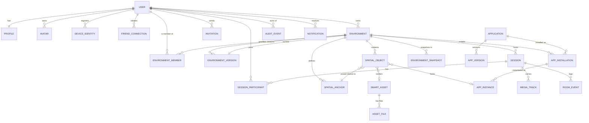

# 04 — Domain model & PostgreSQL schema

## 4.1 Domain model

The prompt lists 45 entities (§21). Building all 45 at MVP would be modelling a
product that does not exist yet. The model below implements **22 entities for the MVP**
and reserves the rest behind named seams.



### MVP entities (22)

`User` · `Profile` · `Avatar` · `DeviceIdentity` · `FriendConnection` · `Environment` ·
`EnvironmentVersion` · `EnvironmentMember` · `EnvironmentSnapshot` · `SpatialAnchor` ·
`SpatialObject` · `SmartAsset` · `AssetFile` · `Application` · `AppVersion` ·
`AppInstallation` · `AppInstance` · `Session` · `SessionParticipant` · `MediaTrack` ·
`RoomEvent` · `Invitation` · plus `AuditEvent` and `Notification` as cross-cutting.

### Deferred entities and their seams

| Deferred | Phase | Seam that keeps it cheap |
|---|---|---|
| `Organization`, `Membership`, `Group` | 3 | **`owner_scope_id` on every ownable row** (§4.4). Today it equals `user_id`; later it points at an org. This is the single most important forward-compatibility decision in the schema. |
| `Device*`, `TelemetryRecord`, digital twins | 7 | `spatial_object.binding` JSONB already carries a typed `deviceRef` slot |
| `MarketplaceListing`, `Purchase`, `License` | 8 | `smart_asset.license` + `application.distribution` JSONB |
| `Material`, `Project*`, `Workflow`, `Automation`, `AIAgent` | 5–10 | New tables, no migration of existing ones |
| `LocationShare`, `Presence` (durable) | 3 | Presence is Redis-only at MVP; the durable table is additive |
| `SyncOperation`, `ConflictRecord` | 4 | HLC columns exist from day one (§4.4) |
| `Dashboard`, `DashboardWidget`, `DataSource` | 5 | MVP dashboard app stores config in `app_instance.state` |

## 4.2 Conventions

Applied to every table. Each exists to prevent a specific, expensive migration.

| Convention | Reason |
|---|---|
| **UUIDv7 primary keys**, client-generatable | Offline/local creation without coordination ([01](01-assumptions-risks.md) R5); time-ordered so B-tree locality is preserved unlike UUIDv4 |
| **`owner_scope_id` + `owner_scope_type`** on ownable rows | Multi-tenancy seam (§4.4). Retrofitting org ownership without it is a full-table rewrite. |
| **`created_at`, `updated_at`** (`timestamptz`) | Non-negotiable |
| **`hlc`** (`bigint`) on mutable, syncable rows | Hybrid logical clock for offline merge ([05](05-realtime.md) §5.9) |
| **`deleted_at`** soft delete on user-visible content | Undo, moderation reversal, GDPR grace window |
| **JSONB for genuinely open shapes** (scene graph, manifest, capabilities) with a versioned `schema_version` column | Avoids 40 columns of speculative structure; keeps validation in one place |
| **No cascading physical deletes across ownership boundaries** | A user deletion is a job, not a `DELETE`. §4.6. |

## 4.3 PostgreSQL schema (MVP)

Abridged to load-bearing tables; `created_at`/`updated_at` omitted where implied.
Tables are grouped by domain for readability, so a few forward references appear
(`spatial_objects` → `smart_assets`); the generated migrations order creation
topologically and add the remaining FKs in a follow-up statement, as shown for
`environments.current_version_id`.

```sql
-- ─────────────────────────────  identity  ─────────────────────────────
CREATE TYPE owner_scope AS ENUM ('user', 'organization');   -- org unused at MVP

CREATE TABLE users (
  id              uuid PRIMARY KEY,                          -- UUIDv7
  email           citext UNIQUE NOT NULL,
  email_verified  boolean NOT NULL DEFAULT false,
  password_hash   text,                                      -- null when OIDC-only
  status          text NOT NULL DEFAULT 'active'
                  CHECK (status IN ('active','suspended','deleted')),
  age_band        text NOT NULL DEFAULT 'adult'
                  CHECK (age_band IN ('adult','teen','child','unknown')),
  created_at      timestamptz NOT NULL DEFAULT now(),
  deleted_at      timestamptz
);
CREATE INDEX ON users (status) WHERE deleted_at IS NULL;

CREATE TABLE profiles (
  user_id      uuid PRIMARY KEY REFERENCES users(id) ON DELETE CASCADE,
  handle       citext UNIQUE NOT NULL,                       -- immutable identity
  display_name text NOT NULL,                                -- mutable, moderatable
  pronouns     text,
  bio          text,
  avatar_id    uuid,                                          -- FK added after avatars
  locale       text NOT NULL DEFAULT 'en',
  hlc          bigint NOT NULL DEFAULT 0
);

-- Device-bound credentials: required for offline/local auth (07 §7.4)
CREATE TABLE device_identities (
  id            uuid PRIMARY KEY,
  user_id       uuid NOT NULL REFERENCES users(id) ON DELETE CASCADE,
  public_key    bytea NOT NULL,                              -- Ed25519, attested
  platform      text NOT NULL,                               -- quest | visionos | ios | ...
  device_name   text,
  last_seen_at  timestamptz,
  revoked_at    timestamptz,
  UNIQUE (user_id, public_key)
);

CREATE TABLE avatars (
  id             uuid PRIMARY KEY,
  owner_scope_id uuid NOT NULL,
  config         jsonb NOT NULL,        -- parametric config (MVP) or VRM asset ref
  asset_id       uuid,                  -- set when custom VRM (phase 3)
  schema_version int NOT NULL DEFAULT 1
);

-- ─────────────────────────────  social  ───────────────────────────────
CREATE TABLE friend_connections (
  id           uuid PRIMARY KEY,
  requester_id uuid NOT NULL REFERENCES users(id) ON DELETE CASCADE,
  addressee_id uuid NOT NULL REFERENCES users(id) ON DELETE CASCADE,
  status       text NOT NULL CHECK (status IN ('pending','accepted','blocked')),
  created_at   timestamptz NOT NULL DEFAULT now(),
  responded_at timestamptz,
  CHECK (requester_id <> addressee_id),
  UNIQUE (requester_id, addressee_id)
);
-- Bidirectional lookup without duplicating rows:
CREATE INDEX ON friend_connections (addressee_id, status);
CREATE INDEX ON friend_connections (requester_id, status);

-- ──────────────────────────  environments  ────────────────────────────
CREATE TABLE environments (
  id                  uuid PRIMARY KEY,
  owner_scope_id      uuid NOT NULL,
  owner_scope_type    owner_scope NOT NULL DEFAULT 'user',
  slug                citext NOT NULL,
  name                text NOT NULL,
  kind                text NOT NULL                          -- see 08 §8.3
                      CHECK (kind IN ('personal_home','mixed_reality','virtual',
                                      'scanned','draft','shared_social','business',
                                      'game','watch_party','digital_twin','temporary')),
  visibility          text NOT NULL DEFAULT 'private'
                      CHECK (visibility IN ('private','invite','friends','org','public')),
  network_mode        text NOT NULL DEFAULT 'online'
                      CHECK (network_mode IN ('online','local','hybrid')),
  current_version_id  uuid,                                   -- FK below
  safety_config       jsonb NOT NULL DEFAULT '{}'::jsonb,     -- 07 §7.6
  hlc                 bigint NOT NULL DEFAULT 0,
  deleted_at          timestamptz,
  UNIQUE (owner_scope_id, slug)
);

-- Immutable published state. The environment row is a mutable pointer to one of these.
CREATE TABLE environment_versions (
  id             uuid PRIMARY KEY,
  environment_id uuid NOT NULL REFERENCES environments(id) ON DELETE CASCADE,
  version        int  NOT NULL,
  scene_graph    jsonb NOT NULL,          -- authored structure; see 08 §8.3
  asset_manifest jsonb NOT NULL,          -- content-addressed asset refs
  content_hash   text NOT NULL,           -- sha256 of canonical bundle
  channel        text NOT NULL DEFAULT 'draft'
                 CHECK (channel IN ('draft','preview','live')),
  published_by   uuid REFERENCES users(id),
  published_at   timestamptz,
  schema_version int NOT NULL DEFAULT 1,
  UNIQUE (environment_id, version)
);
ALTER TABLE environments
  ADD CONSTRAINT fk_env_current_version
  FOREIGN KEY (current_version_id) REFERENCES environment_versions(id);

CREATE TABLE environment_members (
  environment_id uuid NOT NULL REFERENCES environments(id) ON DELETE CASCADE,
  user_id        uuid NOT NULL REFERENCES users(id) ON DELETE CASCADE,
  role           text NOT NULL
                 CHECK (role IN ('owner','admin','operator','collaborator','viewer','guest')),
  granted_by     uuid REFERENCES users(id),
  expires_at     timestamptz,
  PRIMARY KEY (environment_id, user_id)
);
CREATE INDEX ON environment_members (user_id, role);

-- Persistent anchor: the coordinate root that makes "the room persists" work (03 §3.6)
CREATE TABLE spatial_anchors (
  id             uuid PRIMARY KEY,
  environment_id uuid NOT NULL REFERENCES environments(id) ON DELETE CASCADE,
  label          text NOT NULL,
  is_root        boolean NOT NULL DEFAULT false,
  platform_refs  jsonb NOT NULL DEFAULT '{}'::jsonb,  -- {"meta":"<uuid>","openxr":"..."}
  pose           jsonb NOT NULL,                      -- relative to parent/root
  semantic_type  text,                                -- wall | floor | desk | door | ...
  extents        jsonb,                               -- bounds for safety classification
  hlc            bigint NOT NULL DEFAULT 0
);
CREATE UNIQUE INDEX ON spatial_anchors (environment_id) WHERE is_root;

-- Live, mutable placements. Distinct from environment_versions (authored content).
CREATE TABLE spatial_objects (
  id              uuid PRIMARY KEY,
  environment_id  uuid NOT NULL REFERENCES environments(id) ON DELETE CASCADE,
  anchor_id       uuid NOT NULL REFERENCES spatial_anchors(id),
  parent_id       uuid REFERENCES spatial_objects(id) ON DELETE CASCADE,
  kind            text NOT NULL
                  CHECK (kind IN ('asset','app_panel','camera_panel','media_panel',
                                  'annotation','portal','device_twin')),
  asset_id        uuid REFERENCES smart_assets(id),
  app_instance_id uuid,                                -- FK below
  pose            jsonb NOT NULL,                      -- {p:[x,y,z], r:[x,y,z,w], s:[..]}
  pinned          boolean NOT NULL DEFAULT false,
  locked_by       uuid REFERENCES users(id),           -- soft edit lock
  binding         jsonb NOT NULL DEFAULT '{}'::jsonb,  -- deviceRef, dataSourceRef (ph.7)
  visibility      text NOT NULL DEFAULT 'inherit',
  hlc             bigint NOT NULL DEFAULT 0,
  updated_by      uuid REFERENCES users(id),
  deleted_at      timestamptz
);
CREATE INDEX ON spatial_objects (environment_id) WHERE deleted_at IS NULL;
CREATE INDEX ON spatial_objects (parent_id);

-- Room restore point. Full state; the event log carries the deltas between snapshots.
CREATE TABLE environment_snapshots (
  id             uuid PRIMARY KEY,
  environment_id uuid NOT NULL REFERENCES environments(id) ON DELETE CASCADE,
  seq            bigint NOT NULL,
  storage_key    text NOT NULL,           -- object storage; inline only if tiny
  size_bytes     int NOT NULL,
  taken_at       timestamptz NOT NULL DEFAULT now(),
  UNIQUE (environment_id, seq)
);

-- ────────────────────────────  assets  ────────────────────────────────
CREATE TABLE smart_assets (
  id              uuid PRIMARY KEY,
  owner_scope_id  uuid NOT NULL,
  creator_id      uuid REFERENCES users(id),
  name            text NOT NULL,
  kind            text NOT NULL CHECK (kind IN ('model','avatar','material','environment_kit')),
  license         jsonb NOT NULL DEFAULT '{}'::jsonb,
  metadata        jsonb NOT NULL,          -- Smart Asset doc; see 08 §8.2
  budget_report   jsonb,                   -- measured tris, drawcalls, VRAM at ingest
  status          text NOT NULL DEFAULT 'processing'
                  CHECK (status IN ('processing','ready','rejected','quarantined')),
  content_hash    text,
  schema_version  int NOT NULL DEFAULT 1,
  deleted_at      timestamptz
);
CREATE INDEX ON smart_assets (owner_scope_id, status);

CREATE TABLE asset_files (
  id         uuid PRIMARY KEY,
  asset_id   uuid NOT NULL REFERENCES smart_assets(id) ON DELETE CASCADE,
  role       text NOT NULL,                -- source | glb | lod0..lod3 | imposter | collision
  storage_key text NOT NULL,               -- content-addressed
  mime_type  text NOT NULL,
  size_bytes bigint NOT NULL,
  UNIQUE (asset_id, role)
);

-- ─────────────────────  applications & instances  ─────────────────────
CREATE TABLE applications (
  id             uuid PRIMARY KEY,
  app_key        citext UNIQUE NOT NULL,   -- 'com.gearbox.dashboard'
  developer_id   uuid REFERENCES users(id),
  name           text NOT NULL,
  trust_level    text NOT NULL DEFAULT 'first_party'
                 CHECK (trust_level IN ('first_party','verified','community')),
  distribution   jsonb NOT NULL DEFAULT '{}'::jsonb   -- marketplace seam (phase 8)
);

CREATE TABLE app_versions (
  id             uuid PRIMARY KEY,
  application_id uuid NOT NULL REFERENCES applications(id) ON DELETE CASCADE,
  semver         text NOT NULL,
  manifest       jsonb NOT NULL,           -- see 08 §8.1
  bundle_key     text,                     -- null for first-party built-ins
  content_hash   text,
  published_at   timestamptz,
  UNIQUE (application_id, semver)
);

CREATE TABLE app_installations (
  id                uuid PRIMARY KEY,
  environment_id    uuid NOT NULL REFERENCES environments(id) ON DELETE CASCADE,
  app_version_id    uuid NOT NULL REFERENCES app_versions(id),
  installed_by      uuid NOT NULL REFERENCES users(id),
  granted_capabilities jsonb NOT NULL DEFAULT '{}'::jsonb,   -- consented subset
  UNIQUE (environment_id, app_version_id)
);

CREATE TABLE app_instances (
  id              uuid PRIMARY KEY,
  installation_id uuid NOT NULL REFERENCES app_installations(id) ON DELETE CASCADE,
  environment_id  uuid NOT NULL REFERENCES environments(id) ON DELETE CASCADE,
  state           jsonb NOT NULL DEFAULT '{}'::jsonb,   -- persisted app state
  state_bytes     int NOT NULL DEFAULT 0,               -- quota enforcement
  hlc             bigint NOT NULL DEFAULT 0
);
ALTER TABLE spatial_objects
  ADD CONSTRAINT fk_obj_app_instance
  FOREIGN KEY (app_instance_id) REFERENCES app_instances(id) ON DELETE SET NULL;

-- ────────────────────────  sessions & realtime  ───────────────────────
CREATE TABLE sessions (
  id             uuid PRIMARY KEY,
  environment_id uuid NOT NULL REFERENCES environments(id),
  version_id     uuid NOT NULL REFERENCES environment_versions(id),  -- pinned (03)
  network_mode   text NOT NULL CHECK (network_mode IN ('online','local','hybrid')),
  room_node      text,                     -- room-server instance id
  livekit_room   text UNIQUE,
  status         text NOT NULL DEFAULT 'active'
                 CHECK (status IN ('starting','active','draining','ended')),
  started_at     timestamptz NOT NULL DEFAULT now(),
  ended_at       timestamptz
);
CREATE INDEX ON sessions (environment_id, status);

CREATE TABLE session_participants (
  session_id   uuid NOT NULL REFERENCES sessions(id) ON DELETE CASCADE,
  user_id      uuid NOT NULL REFERENCES users(id),
  role         text NOT NULL,              -- resolved from environment_members at join
  presence_mode text NOT NULL DEFAULT 'full_avatar',
  joined_at    timestamptz NOT NULL DEFAULT now(),
  left_at      timestamptz,
  PRIMARY KEY (session_id, user_id, joined_at)
);

CREATE TABLE media_tracks (
  id          uuid PRIMARY KEY,
  session_id  uuid NOT NULL REFERENCES sessions(id) ON DELETE CASCADE,
  user_id     uuid NOT NULL REFERENCES users(id),
  track_sid   text NOT NULL,               -- LiveKit SID
  kind        text NOT NULL CHECK (kind IN ('audio','camera','screen','device_camera')),
  object_id   uuid REFERENCES spatial_objects(id),   -- panel it renders on
  consent_id  uuid,                        -- links to recorded consent (07 §7.7)
  started_at  timestamptz NOT NULL DEFAULT now(),
  ended_at    timestamptz
);

-- Append-only delta log between snapshots. Powers late-join, reconnect, and (later)
-- moderation replay and offline merge.
CREATE TABLE room_events (
  session_id  uuid NOT NULL REFERENCES sessions(id) ON DELETE CASCADE,
  seq         bigint NOT NULL,
  actor_id    uuid,
  type        text NOT NULL,
  payload     jsonb NOT NULL,
  hlc         bigint NOT NULL,
  at          timestamptz NOT NULL DEFAULT now(),
  PRIMARY KEY (session_id, seq)
) PARTITION BY RANGE (at);

-- ──────────────────────  cross-cutting  ───────────────────────────────
CREATE TABLE invitations (
  id             uuid PRIMARY KEY,
  environment_id uuid NOT NULL REFERENCES environments(id) ON DELETE CASCADE,
  inviter_id     uuid NOT NULL REFERENCES users(id),
  invitee_id     uuid REFERENCES users(id),          -- null ⇒ link invite
  token_hash     text UNIQUE NOT NULL,               -- never store the raw token
  role           text NOT NULL,
  max_uses       int NOT NULL DEFAULT 1,
  used_count     int NOT NULL DEFAULT 0,
  expires_at     timestamptz NOT NULL,
  revoked_at     timestamptz
);

CREATE TABLE audit_events (
  id            uuid PRIMARY KEY,
  actor_id      uuid,
  actor_type    text NOT NULL DEFAULT 'user',       -- user | system | ai_agent | device
  action        text NOT NULL,                       -- 'environment.permission.grant'
  resource_type text NOT NULL,
  resource_id   uuid,
  outcome       text NOT NULL CHECK (outcome IN ('allow','deny','error')),
  context       jsonb NOT NULL DEFAULT '{}'::jsonb,  -- ip, device, session, reason
  at            timestamptz NOT NULL DEFAULT now()
) PARTITION BY RANGE (at);
CREATE INDEX ON audit_events (actor_id, at DESC);
CREATE INDEX ON audit_events (resource_type, resource_id, at DESC);

CREATE TABLE notifications (
  id          uuid PRIMARY KEY,
  user_id     uuid NOT NULL REFERENCES users(id) ON DELETE CASCADE,
  type        text NOT NULL,
  payload     jsonb NOT NULL,
  read_at     timestamptz,
  created_at  timestamptz NOT NULL DEFAULT now()
);
CREATE INDEX ON notifications (user_id, created_at DESC) WHERE read_at IS NULL;
```

## 4.4 The two forward-compatibility columns

Everything else in this schema is ordinary. These two are not, and they exist to
prevent the two most expensive migrations this product could face.

**`owner_scope_id` / `owner_scope_type`.** At MVP, `owner_scope_id = user_id` and type
is `'user'`. When organizations arrive (phase 3), an org owns environments and assets
by pointing the same column at an `organizations` row. Without this, adding
multi-tenancy means rewriting every ownable table, every query, and every authorization
check simultaneously. With it, it is a new table plus a resolver change. Cost today:
one extra column. ([01](01-assumptions-risks.md) §1.3 Q4.)

**`hlc` (hybrid logical clock).** A 64-bit `(physical_ms << 16) | logical_counter`
stamped on every mutable, syncable row. At MVP it is nearly unused — the room server is
the single writer. It is what makes offline/local editing mergeable later without a
schema migration on live user data ([05](05-realtime.md) §5.9). Cost today: one
`bigint`.

## 4.5 Indexing and performance notes

- `room_events` and `audit_events` are **partitioned monthly by `at`**. They are the
  two tables that grow without bound; partitioning makes retention a `DROP PARTITION`
  instead of a long-running `DELETE`.
- `spatial_objects` is read per session start (full environment fetch) and written at
  a debounced rate. The partial index on `deleted_at IS NULL` keeps the hot read path
  small.
- Scene-graph traversal uses `parent_id` recursive CTEs. If depth or breadth becomes a
  problem, materialize a `path ltree` column — do **not** reach for a graph database.
- **JSONB validation lives in the application layer** (zod schemas in
  `packages/validation`), not in `CHECK` constraints. Postgres JSON schema constraints
  are painful to evolve; versioned application validators are not.
- `citext` for `email`, `handle`, and `slug` prevents an entire category of duplicate-
  identity bugs.

## 4.6 Retention, deletion, and ownership boundaries

| Data | Retention | Deletion behavior |
|---|---|---|
| `users`, `profiles` | Until deletion request | Soft-delete → 30-day grace → hard-delete job |
| `room_events` | 30 days | Partition drop |
| `environment_snapshots` | Last 10 + daily for 30 days | Lifecycle policy on object storage |
| `audit_events` | 1 year (security), 90 days (operational) | Partition drop; **never user-deletable** |
| `media_tracks` | Metadata 90 days; **no media content persisted** unless a consented recording | Cascade with session |
| Telemetry (phase 7) | 90 days raw, aggregates longer | Partition drop |
| Assets | Until deleted; content-addressed blobs GC'd when unreferenced | Refcount job, not cascade |

**A user deletion is a job, not a `DELETE`.** It must: anonymize authored content
others depend on (an environment a team still uses cannot vanish), transfer or archive
owned environments, revoke device identities, purge PII from `audit_events` context
while preserving the event skeleton, and emit a completion record. Design it in phase 2
— GDPR erasure requests arrive earlier than teams expect, and doing it by hand under
time pressure is how data gets lost.

**Ownership boundary rule:** a cascade delete never crosses an ownership boundary.
Deleting a user must not delete an environment that an organization or another user has
rights in. Every `ON DELETE CASCADE` above is within a single ownership scope; check
any new one against this rule.
