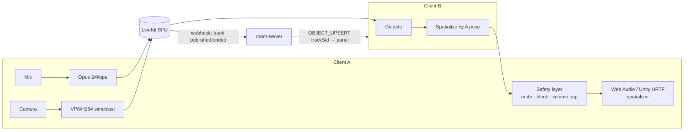
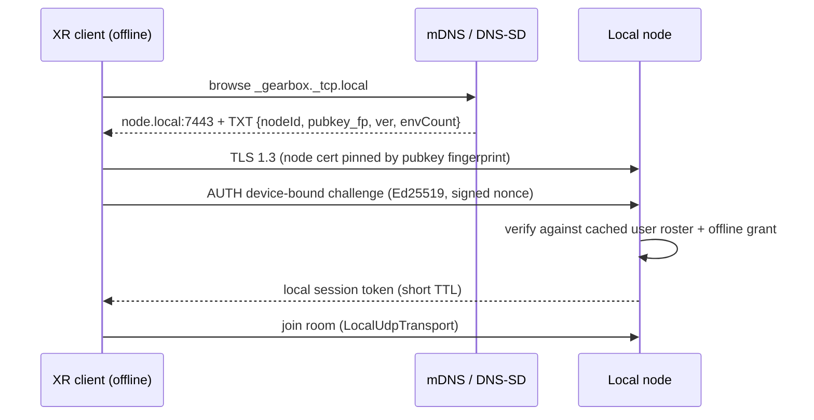

# 05 — Realtime protocol, media, local discovery, offline sync

Covers required outputs #9 (realtime protocol), #11 (WebRTC), #12 (local discovery),
#13 (offline sync).

## 5.1 Authority model

Restated from `docs/vr-ar-social-app/02-netcode.md` §2.1 in GearBox terms — the rule is
identical because the failure mode is identical.

| State | Authority | Why |
|---|---|---|
| Head / hand / body pose | Client, server-validated (speed + teleport clamp) | Round-tripping your own body is unforgivable latency |
| Voice, camera, screen | Client → SFU | Server never decodes media in the hot path |
| Grabbed object transform | **Transferable client authority via lease** | Grabbing must feel instant |
| Object placement, pin, delete, parent | **Server** | Persisted state; permission-checked |
| App instance state | **Server** | Shared and persisted |
| App presentation state (animations, local UI) | Client | Free to diverge; costs nothing |
| Permissions, roles, invitations | **Server, control plane** | Never the room server's job to decide policy |
| Device commands (phase 7) | **Server, with confirmation** | Physical-world consequences |

**Ownership leases are the single mechanism** for grab, seat, tool use, and edit locks.
One concept, many features:

```
OWNERSHIP_REQUEST {objectId, intent}
  → server checks: permission · not already leased · object is leasable
  → OWNERSHIP_GRANT {objectId, holderId, leaseMs: 5000, epoch}
  → holder streams OBJECT_TRANSFORM at 20 Hz; each packet renews the lease
  → lease ends on: release · timeout (2 missed renewals) · disconnect · revoke
  → OWNERSHIP_RELEASE {objectId, finalPose} → server persists, broadcasts
```

`epoch` increments on every grant. Any transform packet carrying a stale epoch is
dropped — this is what prevents the "two clients think they hold it" race after a
reconnect, and it is the bug this design exists to kill.

## 5.2 Transport abstraction

```ts
// packages/networking-sdk — mirrored to C# by tools/protocol-codegen
export interface ITransport {
  connect(cfg: TransportConfig): Promise<void>;
  /** Unreliable, unordered. Pose, transforms — drop is fine, delay is not. */
  sendDatagram(channel: DatagramChannel, payload: Uint8Array): void;
  /** Reliable, ordered per channel. Events, RPC, ownership. */
  sendReliable(channel: ReliableChannel, payload: Uint8Array): Promise<void>;
  on(event: 'datagram' | 'reliable' | 'state' | 'participant', cb: Handler): void;
  disconnect(reason?: string): void;
}
```

Implementations: `LiveKitTransport` (MVP — lossy/reliable data packets),
`WebTransportTransport` (graduation path per [02](02-stack.md) §2.3),
`LocalUdpTransport` (phase 4 LAN), `LoopbackTransport` (tests and the bot harness).

**Nothing above this interface may know which transport is in use.** This is the
mitigation for [01](01-assumptions-risks.md) R4 and it is enforced by lint boundary.

## 5.3 Channels and rates

| Channel | Reliability | Rate | Contents |
|---|---|---|---|
| `POSE` | Unreliable | 20 Hz | Head, 2 hands, root, presence flags |
| `TRANSFORM` | Unreliable | 20 Hz | Leased object transforms |
| `POINTER` | Unreliable | 10 Hz | Ray/pointer, selection highlight |
| `EVENT` | Reliable ordered | On change | Spawn, delete, pin, ownership, app events, permissions |
| `SNAPSHOT` | Reliable ordered | On join / resync | Full or delta room state |
| `CONTROL` | Reliable ordered | Rare | Protocol version, resync request, error, kick |

**Server sim tick: 20 Hz.** Client render: 72–90 Hz, decoupled via interpolation.
Remote entities are rendered on a **100 ms interpolation delay** — smoothing, not
extrapolation. Predicting human limb motion produces the rubber-band artifact that
makes social VR feel wrong; predict only your own avatar and the object you hold.

## 5.4 Wire format

Binary, bit-packed, **generated from a single schema in `packages/protocol`** into both
TypeScript and C#. Hand-mirrored structs on two sides is the highest-frequency bug class
in multiplayer ([03](03-architecture.md) §3.5 rule 1).

```
Header (4 bytes)
  u8  protocolVersion
  u8  messageType
  u16 flags | payloadLen

PoseUpdate (~46 bytes/participant)
  u16  participantId
  u32  tickSeq
  Pose head    (pos: 3×i16 quantized to env bounds; rot: smallest-three quat, 4 bytes)
  Pose leftHand, rightHand
  u8   trackingFlags   (hands valid, eye valid, muted, presenceMode)
  u8   voiceAmplitude  (drives avatar mouth without decoding audio)

TransformUpdate (~26 bytes/object)
  u32  objectId (local index, not UUID)
  u16  epoch
  Pose pose
  u8   flags
```

**Quantization:** position 16-bit per axis over the environment's declared bounds
(~1 mm at 64 m); rotation smallest-three (32 bits); scale only when it changes.

**Never JSON on the hot path.** Reliable-channel messages may use MessagePack — volume
there is two orders of magnitude lower and schema flexibility is worth more than bytes.

**Local IDs, not UUIDs, on the wire.** The session assigns a `u16` participant index
and `u32` object index; the mapping ships in the snapshot. Sending 16-byte UUIDs at
20 Hz wastes ~40% of the packet.

**Budget:** at 8 participants and ~20 active objects, ≈ 90 kbps down / 20 kbps up per
client for state, excluding media.

## 5.5 Snapshot, late join, reconnection

```
SNAPSHOT_FULL {
  sessionId, protocolVersion, tickSeq, hlc,
  participants: [{id, userId, displayName, role, avatarRef, presenceMode, pose}],
  objects:      [{id, uuid, kind, assetRef|appInstanceRef, anchorId, pose,
                  pinned, ownerId, epoch, binding}],
  anchors:      [{id, uuid, pose, semanticType, extents}],
  appInstances: [{id, appKey, version, state}],
  mediaTracks:  [{trackSid, userId, kind, objectId}],
  environment:  {id, versionId, safetyConfig, bounds}
}
```

- **Late join receives current state, never a replay.** The event log is for
  persistence, audit, and merge — not for catching a joiner up.
- **Reconnect within 30 s** presents a resume token with `lastAppliedSeq`. If the
  server still holds the event log tail, it sends `SNAPSHOT_DELTA`; otherwise
  `SNAPSHOT_FULL`. The client must handle both identically — treat the delta path as an
  optimization that is allowed to fail.
- **Any client detecting divergence** (missing object referenced by an event, epoch
  gap) sends `RESYNC_REQUEST` and gets a full snapshot. Cheap, correct, and it converts
  a class of silent desyncs into a visible hitch.
- **Server restart / deploy:** session enters `draining`, a snapshot is written, clients
  receive `CONTROL:MIGRATE {newEndpoint, resumeToken}`. Target < 2 s visible
  disruption. Build this in sprint 5 — retrofitting it means every deploy dumps every
  user, which means you stop deploying.

## 5.6 Persistence: snapshots + event log

```
Room tick 20 Hz
  ├─ apply inputs → validate → mutate component store
  ├─ append durable mutations to in-memory event ring (seq, hlc, actor, type, payload)
  ├─ every 2 s (debounced): flush ring → room_events; upsert changed spatial_objects
  └─ every 60 s or on drain: write environment_snapshots + prune events < snapshot.seq
```

Transform *streams* are never persisted — only the **final pose on lease release**.
Persisting 20 Hz transforms is the single easiest way to melt your database, and it is
a mistake teams make once.

## 5.7 WebRTC media architecture



**Design rules:**

1. **Spatialization is client-side**, driven by the speaker's pose from the `POSE`
   channel. Server-side mixing would be O(N²) CPU and would forfeit head-relative HRTF.
2. **Voice subscription is interest-managed** — nearest/loudest ~12 speakers plus your
   party regardless of distance. At MVP (≤ 8) everyone subscribes to everyone; the cap
   exists in code from day one so it is not a later refactor.
3. **Camera panels are spatial objects that reference a `trackSid`.** The object is
   authoritative state (position, size, who may see it); the media is a LiveKit track.
   Clean separation — a camera panel survives a track restarting.
4. **Simulcast + adaptive subscription:** panels render at a resolution matched to
   their on-screen size. A wall-sized panel gets the high layer; a distant pinned
   thumbnail gets the low one. This is where camera-panel frame cost is actually won
   ([01](01-assumptions-risks.md) R2).
5. **Safety and privacy are enforced client-side before playback** — mute, block, and
   the personal volume cap sit below any app's reach.
6. **Consent before capture.** Publishing a camera or screen track requires an explicit
   in-session consent record (`media_tracks.consent_id`), a persistent visible
   indicator on the avatar, and an entry in the room's active-capture list. Recording
   requires **all-party** consent ([07](07-authz-security.md) §7.7).
7. **Watch Together** synchronizes a playback clock over the `EVENT` channel with host
   authority and drift correction; media itself comes from an approved integration or
   the user's own file. No DRM bypass, no re-streaming — accept this as a real feature
   limitation rather than discovering it late.

**Bandwidth per client at MVP:** ~410 kbps down / ~75 kbps up with voice + one camera
panel; ~1.2 Mbps down with three panels at medium quality.

## 5.8 Local-network discovery (phase 4, designed now)



- **Discovery:** mDNS/DNS-SD (`_gearbox._tcp.local`), with manual IP entry as the
  always-available fallback — mDNS is blocked on a lot of real networks, especially
  corporate and guest Wi-Fi.
- **Trust:** the node presents a self-signed cert; the client pins the fingerprint on
  first pairing (TOFU) and shows a short verification code the user confirms **on both
  devices**. This is the mitigation for LAN spoofing
  ([07](07-authz-security.md) §7.5 T11).
- **Auth without internet:** device-bound Ed25519 keypair + an **offline grant** — a
  short-lived, signed capability pre-issued by the cloud and cached ([07](07-authz-security.md) §7.4).
- **Media on LAN:** the node runs an embedded SFU, or falls back to a full peer mesh at
  ≤ 4 participants where mesh is genuinely cheaper.
- **Hybrid promotion:** a running local session gets a cloud relay attached
  *without restarting* — the node opens an outbound connection to the cloud room server,
  which becomes a peer in the authority chain. The prompt requires exactly this
  ("invite a remote participant without restarting the room"), and it is why the
  authority layer is an interface (§5.10) rather than a hardcoded cloud assumption.

## 5.9 Offline synchronization

Three classes of state, three strategies. Using one strategy for all of them is the
common mistake.

| State class | Strategy | Rationale |
|---|---|---|
| **Object placement / layout** (pose, pin, parent) | **LWW per field, keyed by HLC**, tie-broken by `nodeId` | Last placement genuinely wins — nobody wants a merged chair position |
| **Sets** (installed apps, members, tags) | **OR-Set CRDT** | Add/remove concurrency is real and merges cleanly |
| **Counters / quotas** | **Server-authoritative only; never offline-mutable** | Merging counters invents value out of nothing |
| **Text / annotations** (phase 5) | Y.js CRDT | Concurrent editing is the point |
| **Permissions, invitations, payments** | **Never offline-mutable.** Queue as *intents*, apply on reconnect after re-authorization | Offline permission grants are a privilege-escalation vector, not a sync problem |

**Hybrid logical clock** — `(physical_ms << 16) | counter`, stamped by whichever node
performs the mutation, so causality survives clock skew between a local node and cloud.

**Reconciliation on reconnect:**

```
1. Node sends its outbound queue (ordered mutations, each with HLC + originating device)
2. Cloud replays against current state:
     – no conflict            → apply
     – conflict, LWW field    → higher HLC wins; loser recorded in conflict_records
     – conflict, OR-Set       → merge
     – conflict, restricted   → reject; surface to user as a reviewable item
3. Cloud returns authoritative delta; node rebases and re-snapshots
4. Anything unresolvable is surfaced in the UI — never silently discarded
```

**Split-brain rule:** an environment has exactly one **authority owner** at a time
(cloud or a specific local node), recorded in `sessions.network_mode` + a lease. Two
nodes cannot both be authoritative for the same environment. If a node's lease expires
while it is partitioned, its subsequent changes are merged as above rather than applied
directly. This one rule removes an entire class of unresolvable conflict.

## 5.10 Authority interface (the seam that makes local mode a port)

```ts
export interface IAuthority {
  validateInput(p: ParticipantId, i: Input): ValidationResult;
  can(p: ParticipantId, action: Action, resource: ResourceRef): boolean;
  persist(mutations: Mutation[]): Promise<void>;
  issueLease(o: ObjectId, p: ParticipantId): Lease | null;
  resolveIdentity(token: string): Promise<Identity>;
}
```

`CloudAuthority` (MVP) talks to `gearbox-core` and Postgres. `LocalAuthority` (phase 4)
talks to the node's embedded store and cached roster. `HybridAuthority` (phase 4)
composes both, preferring local for latency and cloud for anything requiring global
consistency.

Writing this interface in sprint 3 costs roughly a day. Not writing it means local mode
is a rewrite of the room server rather than a new implementation — which is
[01](01-assumptions-risks.md) R5 in one sentence.

## 5.11 Network quality adaptation

Degrade in this order — from the master prompt §12 priority list, made mechanical:

```
Headroom shrinking →
  1. Reduce non-essential visual updates (distant object transforms → 5 Hz)
  2. Drop camera panel layers (simulcast: high → medium → low → paused thumbnail)
  3. Reduce pose rate 20 → 10 Hz, widen interpolation buffer
  4. Drop finger joints, then hand poses
  5. Reduce voice bitrate 24 → 16 kbps
NEVER degrade:
  – safety boundary rendering
  – voice presence (silence is worse than low quality)
  – ownership/permission events
  – device commands (phase 7)
  – the exit/menu path
```

Signal source: LiveKit connection quality + RTT/loss from the transport, hysteresis on
both edges so quality does not oscillate. Every level change emits a telemetry event —
this is the data that tells you whether your adaptation policy is actually right.
