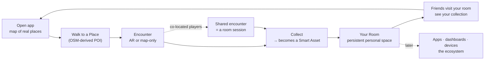
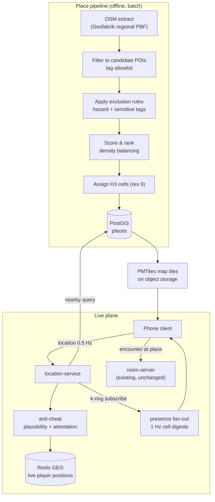

# 11 — Revised MVP: location-based AR entry product

**This document supersedes the MVP definition in [09](09-mvp-backlog-sprints.md) §9.1
and §9.3–9.4.** Docs 02–08 remain valid; the deltas they need are collected here.

## 11.1 Decisions locked

| # | Question | Answer |
|---|---|---|
| 1 | Scope | **Vertical slice** (16 weeks), not the §27 30-item list |
| 2 | Engine | **Unity 6** |
| 3 | Devices | **No restriction** — see §11.3 for the staged QA order this implies |
| 4 | First user | **Location-based AR game players** (Pokémon Go–style), funnelling into the ecosystem |
| 5 | Slice shape | **Game slice + bridge into a persistent room** |
| 6 | Place data | **OpenStreetMap + own curation** |

## 11.2 What this changes, and what survives

Answer 4 is a pivot, not a refinement. Pokémon Go players are **on phones, outdoors,
in public, at city scale**. The previous MVP was headset-first, indoors, 8 people in a
room. Three whole problem domains arrive that the earlier plan does not contain:
**geospatial data**, **location anti-cheat**, and **outdoor physical safety**.

| Previous plan | Now |
|---|---|
| Quest 3 lead client, mobile as companion | **Phone AR (iOS + Android) is the lead client**; headset is the second surface |
| Indoor room boundary + room mesh | **Real-world places, GPS, H3 cells**; room mesh moves to the room half of the slice |
| 8 users in a session | **Thousands of players in a city**, promoted into ≤8-person sessions at a place |
| 20 Hz pose netcode | **1 Hz location presence** outdoors + the existing 20 Hz netcode inside encounters |
| Threat model: room invasion, asset abuse | **+ GPS spoofing as the #1 threat**, and it funds itself |
| Safety: guardian, obstacles | **+ traffic, water, railways, trespass, night play, minors outdoors** |

**What survives unchanged — most of the engineering:**

- Unity 6 (**this answer makes it more right, not less**: AR Foundation covers ARKit +
  ARCore and OpenXR covers headsets from one codebase — see §11.3)
- The entire control plane, modular monolith, and API design ([02](02-stack.md), [06](06-api.md))
- The room-server, ownership leases, snapshots, late join, reconnect ([05](05-realtime.md)) —
  **an encounter at a place *is* a room session**, which is the architectural piece of
  luck that makes this pivot cheap
- Environment/anchor model, Smart Assets, app manifest ([08](08-schemas.md))
- Authorization core, audit, token model ([07](07-authz-security.md))
- Data model conventions, especially `owner_scope_id` and HLC ([04](04-data-model.md) §4.4)

**What is genuinely new:** §§11.4–11.9 below.

## 11.3 Target platforms — staging "no restrictions"

You said no device restriction, and Unity + the `IPlatformXR` port makes broad support
architecturally cheap. **QA is what does not scale**, so the platforms are staged by
*test burden*, not by capability:

| Tier | Platforms | Status at MVP |
|---|---|---|
| **Lead** | iOS (ARKit) + Android (ARCore) phones | Fully tested, release-gated. This is where your users are. |
| **Second** | Quest 3 / 3S (OpenXR + passthrough) | Room half of the slice only — the outdoor loop is meaningless on a headset. Tested, but a thinner matrix. |
| **Best-effort** | Desktop (flat-screen), web viewer | Builds run in CI, smoke-tested, not release-gated |
| **Reserved** | visionOS, Android XR, SteamVR | `IPlatformXR` adapters stubbed; enabled when there is a reason |

**The one thing to hold:** device breadth is free in the *architecture* and expensive
in the *test matrix*. Every tier you release-gate multiplies manual QA. Adding a tier
later costs an adapter and a test pass; adding it now costs a test pass every sprint
forever.

**Minimum phone spec:** ARCore/ARKit-capable, 4 GB RAM. Below that, ship the **map-only
mode** (§11.7) — which a large fraction of players will use anyway, because holding a
phone up in public is socially expensive.

## 11.4 The product loop



**The bridge is the whole thesis, and it is step D→E.** A collected thing is not a row
in an inventory screen — it is a **Smart Asset with provenance** (which real place,
when, who you were with) that appears as a physical object in a room you own and
decorate. The game acquires the user; the room retains them; the room later becomes the
spatial OS home. If the slice proves only the game loop, it has proven the easy half.

**Acceptance test for the slice (replaces [09](09-mvp-backlog-sprints.md) §9.1):**

> A player signs up, sees real nearby places on a map, walks to one, completes an
> encounter (alone or with another player physically present), collects an item, and
> finds that item as a real object in their persistent room — enterable from the phone
> and, on a headset, in immersive VR — with a friend able to visit and see it.

## 11.5 Geospatial architecture



### Place data: OSM, and the licence obligation nobody plans for

OSM is the right call — free, no per-request cost, no ToS clause about game use, and
you own the resulting database. **But ODbL is a share-alike licence and it has teeth:**

- **Attribution** ("© OpenStreetMap contributors") must appear in-app. Easy.
- A **Derivative Database** — your places table, if it is built from OSM data — inherits
  ODbL **if you publicly distribute it**. Internal use and serving results to your own
  app is generally *not* distribution, but the boundary is exactly where a games company
  ends up (public APIs, data partnerships, an acquirer's diligence).
- A **Produced Work** (rendered tiles, game visuals, screenshots) is *not* share-alike.

**Design mitigation — worth doing from day one because it is nearly free now and a
migration later:** keep the OSM-derived geometry and the game's own curation in
**separate tables** (`places` ← OSM-derived, `place_gameplay` ← wholly your own:
spawn weights, encounter types, balance, moderation state), joined by reference. If a
share-alike obligation ever bites, it bites the OSM-derived table only, and your
gameplay IP is cleanly separable. **Get this reviewed by a lawyer before launch** — I am
describing the licence's shape, not giving legal advice, and the "is it distribution?"
question is genuinely fact-specific.

### The candidate-POI filter

Start narrow. A good place is **publicly accessible, safe to stand at, interesting, and
not somewhere a stranger loitering causes harm.**

```
Allow (OSM tags):  tourism=artwork|viewpoint|museum · historic=* (see denials)
                   amenity=fountain|library|theatre|marketplace|community_centre
                   leisure=park|playground(daytime only) · natural=peak
                   man_made=lighthouse|water_tower
Deny  (hard):      amenity=hospital|clinic|police|fire_station|school|kindergarten
                   landuse=military · office=government · barrier=*
                   historic=memorial where memorial:type=war|holocaust
                   amenity=place_of_worship  (opt-in only, after outreach)
                   any node inside a private-property polygon
Hazard exclusion:  within 15 m of highway=motorway|trunk|primary
                   within 25 m of railway=rail|light_rail|tram
                   within 10 m of natural=water|coastline, waterway=*
                   within 20 m of natural=cliff
```

**The hazard rules come free from OSM tags** — this is the strongest argument for OSM
over a commercial POI feed, which gives you richer places and no hazard geometry. The
sensitive-location denials are the ones every game in this genre learned publicly and
painfully; take them as given rather than rediscovering them.

**Curation queue:** algorithmic selection puts candidates into a human review queue
before a region goes live. Budget real human time for this — one reviewer can clear
roughly a mid-sized city per week, and it is the difference between a place list that
delights and one that makes the news.

### Indexing and sharding: H3

- **H3 resolution 9** (~0.1 km², ~174 m edge) as the gameplay cell — the unit for
  spawns, interest, and sharding.
- **H3 resolution 6** (~36 km²) as the region/shard key for operational partitioning.
- Hexagons over S2 squares here because **every neighbour is equidistant** — "nearby
  players and places" is a k-ring query with no corner/edge asymmetry, and spawn
  distribution is uniform without correction.
- **PostGIS `geography` + GiST** for exact distance ("am I within 40 m of this place?").
  H3 narrows the candidate set; PostGIS answers precisely. Use both; neither alone.

### Live location: Redis, never Postgres

10k concurrent players at 0.5 Hz is **5,000 writes/s** of position data. That must not
touch your relational database.

- **Redis GEO** (`GEOADD` / `GEOSEARCH`) holds live player positions with a TTL.
  Ephemeral by design — losing it drops presence, never durable state.
- **Postgres holds places and durable player state only** — never a position stream.
- **Raw location traces are never persisted.** Retain the current fix plus a short
  rolling window (≤ 15 min) for anti-cheat plausibility, then discard. See §11.8.

### Presence at city scale

Outdoors needs a completely different netcode from a room, and conflating them is the
mistake to avoid:

| | Outdoor presence | Encounter / room |
|---|---|---|
| Rate | **1 Hz cell digest** | 20 Hz pose |
| Content | Counts, coarse positions, place activity | Full pose, hands, objects |
| Fidelity | ~10 m quantized | ~1 mm |
| Transport | Reliable, batched (WebSocket is fine here) | LiveKit datagrams |
| Authority | Server-computed digests | Room-server sim |

A client subscribes to its H3 res-9 cell plus the k=1 ring (7 cells) and receives a 1 Hz
digest. **Never broadcast exact positions of other players outdoors** — that is both a
bandwidth problem and a stalking vector (§11.8).

**Promotion to a room session:** when 2–8 players are co-located at the same place and
opt in, the existing `POST /sessions` path allocates a room-server session scoped to
that place. Everything from [05](05-realtime.md) applies unchanged. This is why the
earlier work survives the pivot intact.

## 11.6 Anti-cheat: GPS spoofing

**This is now the #1 threat in the product** ([07](07-authz-security.md) gains T21). In
this genre, spoofing is not vandalism — it is a business. It devalues the economy,
destroys local-play fairness, and drives away exactly the users you acquired.

**The framing that keeps you sane: you cannot win outright. The goal is to make
spoofing expensive, detectable, and unprofitable** — not impossible.

### Layered detection

| Layer | Signal | Notes |
|---|---|---|
| **Platform attestation** | Play Integrity (Android), App Attest / DeviceCheck (iOS) | Cheapest high-value signal. Catches emulators, tampered builds, most rooted/jailbroken devices. Not sufficient alone. |
| **OS mock-location flags** | `isFromMockProvider`, location-provider inspection | Trivially defeated by good spoofers; still catches the long tail |
| **Kinematic plausibility** | Speed, acceleration, jerk between fixes; altitude continuity; accuracy/HDOP distribution | Real GPS is *noisy*; perfectly smooth tracks are themselves a signal |
| **Sensor cross-check** | Pedometer / accelerometer vs claimed displacement | **The strongest single signal.** 5 km travelled with zero step events is not a walk. |
| **Route feasibility** | Path crosses buildings, water, motorways, or private land | You already have the geometry from OSM |
| **Behavioural** | Play/travel profile, cell-transition graph, session length, 24/7 activity | Slow but very hard to evade |
| **Network** | Datacentre/VPN egress correlated with claimed rural location | Weak alone, useful corroboration |

### Response ladder — never insta-ban on one signal

GPS is genuinely noisy; tunnels, urban canyons, and cheap chipsets produce teleports.
A single-signal ban policy will punish real players, and they will be loud about it.

```
score < 0.3   → normal
0.3 – 0.6     → silent: reduce rare-spawn eligibility, flag for review
0.6 – 0.85    → soft: rewards throttled, cannot participate in shared encounters
                 (protects honest co-located players — the ones you must not lose)
> 0.85        → hard: suspend, with an appeal path and the evidence summarized
sustained     → device + account action; attestation key blocked
```

**Server-authoritative always.** The client *reports* location; the server *decides*
whether the player is at a place. Rewards, encounters, and collection are granted
server-side or they are not real. Anything decided client-side is a spoofer's API.

**Instrument the appeal path from day one.** False positives are certain, and how you
handle them is the whole reputation of your anti-cheat.

## 11.7 Outdoor physical safety

Higher-stakes than the indoor guardian work in [07](07-authz-security.md) §7.6, and
the failure mode is injury and litigation, not a bad review. **These are client-layer
invariants with no override**, same architectural posture as the guardian.

| Invariant | Mechanism |
|---|---|
| **No gameplay above walking speed** | Interaction locked above ~15 km/h. A passenger override exists but is deliberately high-friction (explicit per-trip confirmation), never remembered, and logged. |
| **No place within a hazard buffer** | Enforced at ingest (§11.5), re-checked at spawn. A place near a motorway simply does not exist. |
| **Map-only mode is first-class, and the default** | AR camera is opt-in and prompted for short bursts. Walking while staring through a phone camera is the core physical risk in this genre; do not make it the default path. |
| **Look-up prompts** | Periodic "watch your surroundings" interstitials during sustained movement — annoying and correct |
| **No mandatory AR** | Every encounter is completable in map-only mode. AR is enhancement, never a gate. |
| **Sensitive-location exclusion + takedown flow** | §11.5 denials, plus a **landowner/authority removal request** path that must exist **at launch**, with an SLA and a human owner |
| **Night and isolation caution** | Reduced spawn weight in unlit/isolated areas after dark; stronger for accounts in the teen age band |
| **Trespass framing** | Places are always reachable from public ground; encounters never require entering private property, and the UI says so |
| **No safety exception for gameplay** | Any request phrased as "let an event override the speed lock" is refused |

**Minors:** teen-band accounts get tightened defaults — no exact-location sharing at
all, night-hour spawn suppression, no encounter matching with non-friends. The age band
from [04](04-data-model.md) already exists; this is where it starts doing work.

## 11.8 Location privacy

Precise, continuous, real-world location on consumer phones is **the most sensitive data
class in the entire GearBox vision** — more sensitive than room scans, and squarely
regulated (GDPR personal data; several regimes treat precise location as a special
category in practice, and app-store policy adds its own rules).

- **Never broadcast another player's exact position.** Outdoor presence is cell-level
  digests and ~10 m quantization (§11.5). Friends may share precise position only with
  an explicit, expiring, revocable grant — the model already specified in
  [07](07-authz-security.md) §7.7.
- **No raw trace persistence.** Rolling ≤ 15 min window for anti-cheat, then discarded.
  Analytics get H3 cell aggregates, never point traces.
- **Foreground-only location** at MVP. Background location is a large permission ask, an
  app-store review risk, and a battery complaint; the game does not need it yet.
- **A visible, always-available indicator** of what location sharing is currently active
  and exactly who can see it, with one-tap stop.
- **Teen band: exact location sharing disabled outright**, not merely defaulted off.
- **Export and deletion** must cover location data specifically, and the deletion job
  must reach Redis, not just Postgres.

## 11.9 Data model additions

New tables. Conventions from [04](04-data-model.md) §4.2 apply throughout — and note
the ODbL separation between `places` and `place_gameplay` (§11.5).

```sql
CREATE EXTENSION IF NOT EXISTS postgis;

-- OSM-derived. Treat as a distinct database for licence purposes.
CREATE TABLE places (
  id              uuid PRIMARY KEY,
  osm_type        text NOT NULL CHECK (osm_type IN ('node','way','relation')),
  osm_id          bigint NOT NULL,
  name            text,
  category        text NOT NULL,
  geom            geography(Point, 4326) NOT NULL,
  h3_r9           bigint NOT NULL,
  h3_r6           bigint NOT NULL,
  osm_tags        jsonb NOT NULL,
  source_extract  text NOT NULL,              -- provenance for attribution + refresh
  imported_at     timestamptz NOT NULL DEFAULT now(),
  UNIQUE (osm_type, osm_id)
);
CREATE INDEX ON places USING gist (geom);
CREATE INDEX ON places (h3_r9);
CREATE INDEX ON places (h3_r6);

-- Wholly our own. No OSM-derived content in this table.
CREATE TABLE place_gameplay (
  place_id        uuid PRIMARY KEY REFERENCES places(id) ON DELETE CASCADE,
  status          text NOT NULL DEFAULT 'candidate'
                  CHECK (status IN ('candidate','approved','rejected','suspended','removed_on_request')),
  encounter_types text[] NOT NULL DEFAULT '{}',
  spawn_weight    numeric(5,3) NOT NULL DEFAULT 1.0,
  hazard_flags    text[] NOT NULL DEFAULT '{}',   -- motorway|rail|water|cliff|unlit
  daytime_only    boolean NOT NULL DEFAULT false,
  reviewed_by     uuid REFERENCES users(id),
  reviewed_at     timestamptz,
  removal_reason  text,                            -- landowner/authority takedown
  hlc             bigint NOT NULL DEFAULT 0
);
CREATE INDEX ON place_gameplay (status) WHERE status = 'approved';

CREATE TABLE place_removal_requests (
  id           uuid PRIMARY KEY,
  place_id     uuid NOT NULL REFERENCES places(id),
  requester    jsonb NOT NULL,                    -- contact + claimed relationship
  reason       text NOT NULL,
  status       text NOT NULL DEFAULT 'open'
               CHECK (status IN ('open','actioned','declined')),
  actioned_by  uuid REFERENCES users(id),
  created_at   timestamptz NOT NULL DEFAULT now(),
  actioned_at  timestamptz
);

-- Durable player game state. Live positions live in Redis, never here.
CREATE TABLE player_states (
  user_id          uuid PRIMARY KEY REFERENCES users(id) ON DELETE CASCADE,
  level            int NOT NULL DEFAULT 1,
  xp               bigint NOT NULL DEFAULT 0,
  home_h3_r6       bigint,                         -- coarse home region, NOT an address
  trust_score      numeric(4,3) NOT NULL DEFAULT 1.0,   -- anti-cheat, §11.6
  last_fix_at      timestamptz,
  hlc              bigint NOT NULL DEFAULT 0
);

CREATE TABLE encounters (
  id           uuid PRIMARY KEY,
  place_id     uuid NOT NULL REFERENCES places(id),
  kind         text NOT NULL,
  session_id   uuid REFERENCES sessions(id),        -- set when co-op → room session
  started_at   timestamptz NOT NULL DEFAULT now(),
  ended_at     timestamptz,
  outcome      text
);
CREATE INDEX ON encounters (place_id, started_at DESC);

CREATE TABLE encounter_participants (
  encounter_id uuid NOT NULL REFERENCES encounters(id) ON DELETE CASCADE,
  user_id      uuid NOT NULL REFERENCES users(id),
  verified_at_place boolean NOT NULL,               -- server's location decision
  trust_at_time     numeric(4,3) NOT NULL,
  PRIMARY KEY (encounter_id, user_id)
);

-- The bridge: a collected thing IS a Smart Asset instance with provenance.
CREATE TABLE collected_items (
  id             uuid PRIMARY KEY,
  user_id        uuid NOT NULL REFERENCES users(id) ON DELETE CASCADE,
  asset_id       uuid NOT NULL REFERENCES smart_assets(id),
  encounter_id   uuid REFERENCES encounters(id),
  provenance     jsonb NOT NULL,   -- {placeId, placeName, h3_r9, collectedAt, withUserIds[]}
  spatial_object_id uuid REFERENCES spatial_objects(id),   -- placement in the owner's room
  hlc            bigint NOT NULL DEFAULT 0,
  created_at     timestamptz NOT NULL DEFAULT now()
);
CREATE INDEX ON collected_items (user_id, created_at DESC);

-- Append-only anti-cheat signals. Never raw traces — scores and verdicts only.
CREATE TABLE cheat_signals (
  user_id   uuid NOT NULL REFERENCES users(id) ON DELETE CASCADE,
  at        timestamptz NOT NULL DEFAULT now(),
  signal    text NOT NULL,        -- attestation|kinematic|sensor|route|behavioural
  score     numeric(4,3) NOT NULL,
  context   jsonb NOT NULL,
  PRIMARY KEY (user_id, at, signal)
) PARTITION BY RANGE (at);
```

**Note the `provenance` field on `collected_items`.** It is the emotional payload of the
bridge — "the one I caught at the harbour with Sam, in October" — and it costs one JSONB
column. Design it in now; it is the reason someone decorates a room instead of reading
an inventory list.

## 11.10 Place schema (client-facing)

```jsonc
{
  "schemaVersion": 1,
  "placeId": "018f...",
  "name": "Harbour Lighthouse",
  "category": "man_made.lighthouse",
  "position": { "lat": 55.6761, "lon": 12.5683 },   // ~5 m rounded for client delivery
  "h3": { "r9": "8928308280fffff", "r6": "862830827ffffff" },
  "interactionRadiusM": 40,
  "encounter": { "types": ["collect","co-op"], "maxParticipants": 8, "daytimeOnly": false },
  "safety": { "hazardFlags": [], "publicAccess": true, "notes": null },
  "presentation": { "iconId": "lighthouse", "modelAssetId": "018f...", "arAnchoring": "ground-plane" },
  "attribution": "© OpenStreetMap contributors"
}
```

**`interactionRadiusM` is advisory to the client and authoritative on the server.** The
client uses it to render the ring; the server independently decides whether you are
there. Never let the client's opinion of "close enough" grant anything.

## 11.11 Scale & cost delta

The cost shape is completely different from the room-based model in
[10](10-quality-devops.md) §10.4 — an LBG has enormous DAU relative to in-room CCU.

| Driver | Shape | Mitigation |
|---|---|---|
| Location writes | DAU × 0.5 Hz × session minutes | Redis, not Postgres. ~5k writes/s at 10k concurrent is a single modest Redis node. |
| Presence fan-out | Cells × subscribers × 1 Hz | Digest per cell computed once, fanned out — never per-player computation |
| Map tiles | Downloads per new area per user | **Self-host PMTiles on R2** — a single-file tile archive, zero egress, no per-request tile bill. This is the biggest avoidable cost in the genre. |
| Place queries | Per movement into a new cell | H3 cell key → cached in Redis; Postgres only on cache miss |
| Encounter sessions | Only co-op encounters allocate a room-server | The expensive path is the rare path — most encounters are solo and cost nothing |
| Anti-cheat | Per-fix scoring | Cheap kinematic checks inline; expensive behavioural analysis batched offline |

**Pilot cost is essentially unchanged from [10](10-quality-devops.md) §10.4** (≈ $110–260/mo)
plus one Redis upgrade and one-off OSM processing. **The genre's real cost cliff is
map tiles and location writes**, and both are designed out above rather than discovered
in a bill.

## 11.12 New risks

| # | Risk | Mitigation |
|---|---|---|
| **R11** | **Spoofing economy forms before you have detection.** Once a spoofing tool exists for your game, it is permanent. | Attestation + kinematic + sensor cross-check **in the MVP, not phase 2**. Ship with the ladder in §11.6 live. |
| **R12** | **A safety incident.** Injury or trespass attributable to a place you spawned. | §11.7 invariants, hazard exclusion at ingest, human curation before a region goes live, takedown flow at launch, incident runbook with a named owner. |
| **R13** | **ODbL derived-database obligation** surfaces at a partnership, public API, or acquisition. | Table separation (§11.5) + legal review before launch. Cheap now, structural later. |
| **R14** | **Cold start is geographic.** A location game with no players nearby is worse than an empty room — it is a solved-looking map with nobody on it. | Launch **one city**, not one country. Seed with local events. Density beats coverage every time in this genre. |
| **R15** | **The bridge doesn't land.** Players enjoy the game and ignore the room, leaving you with a modest game and no ecosystem. | Instrument it as **the** primary success metric (§11.13). Make the room the only place collections live — never build a flat inventory screen as an alternative, or everyone will use it. |
| **R16** | **Battery and thermal.** GPS + camera + AR drains a phone in under an hour; this is the top-reviewed complaint in the genre. | Map-only default, adaptive fix rate (1 Hz moving → 0.1 Hz stationary), AR sessions time-boxed, on-device thermal telemetry in CI |

## 11.13 Success metrics for the slice

The slice succeeds or fails on the bridge, so measure that, not DAU:

| Metric | Meaning | Bar worth betting on |
|---|---|---|
| **Room entry rate** | % of collectors who enter their room within 24 h | **> 60%** — below this, the bridge is decoration |
| **Room return rate** | % who re-enter the room on a later day without collecting first | **> 25%** — this is the ecosystem signal, and it is the number that matters most |
| Place-visit conversion | % of map viewers who reach a place | > 40% |
| D7 retention | Standard | > 25% |
| Co-op encounter rate | % of encounters with 2+ verified co-located players | > 15% — proves the multiplayer substrate earns its cost |
| Spoof prevalence | Flagged accounts / active | < 3%, and *measured* rather than assumed |
| Safety incidents | Reports of hazardous/sensitive places | Zero tolerance; every one triaged |

**Room return rate is the one that decides whether GearBox is a platform or a game.**

## 11.14 Revised backlog

Supersedes [09](09-mvp-backlog-sprints.md) §9.3. Epics A (foundations) and B (identity)
carry over largely unchanged; A6 becomes mobile-AR-first. `S` = story points.

| ID | Story | S |
|---|---|---|
| **A — Foundations** | | |
| A1–A5 | Monorepo, Compose dev env, protocol codegen, migrations, observability (as [09](09-mvp-backlog-sprints.md)) | 26 |
| A6′ | Unity 6 skeleton: **AR Foundation (ARKit + ARCore)** + `IPlatformXR` port + Quest adapter | 13 |
| A7′ | Bot harness — **now also simulates GPS tracks** (honest + spoofed) | 13 |
| A8 | Device perf/thermal/battery CI harness | 5 |
| **B — Identity** | B1–B7 from [09](09-mvp-backlog-sprints.md), mobile sign-in instead of VR device-code | 29 |
| **P — Place pipeline** | | |
| P1 | OSM extract ingest, tag filter, PostGIS + H3 indexing | 8 |
| P2 | Hazard + sensitive-location exclusion rules from OSM geometry | 8 |
| P3 | Curation queue + review console + approve/reject/suspend | 8 |
| P4 | Removal-request intake and workflow | 5 |
| P5 | PMTiles generation + hosting + client map rendering | 8 |
| **L — Location & anti-cheat** | | |
| L1 | Location ingest API, Redis GEO, adaptive fix rate | 8 |
| L2 | Server-authoritative proximity ("am I at this place?") | 5 |
| L3 | Platform attestation (Play Integrity / App Attest) | 8 |
| L4 | Kinematic + sensor cross-check scoring | 8 |
| L5 | Trust score, response ladder, appeal path | 8 |
| L6 | Cell-digest presence fan-out at 1 Hz | 8 |
| **G — Game loop** | | |
| G1 | Map view: nearby places, player position, interaction rings | 8 |
| G2 | Solo encounter (map-only mode) | 8 |
| G3 | AR encounter mode (opt-in, plane-anchored) | 13 |
| G4 | Collection → Smart Asset instance with provenance | 8 |
| **E — Co-located multiplayer** | | |
| E1 | Encounter → room session promotion (reuses [05](05-realtime.md) unchanged) | 8 |
| E2 | Shared encounter sync + verified co-location | 8 |
| E3 | Friends, invitations, presence | 8 |
| **R — Room & the bridge** | | |
| R1 | Personal room environment: create, load, persist | 8 |
| R2 | Collected items as placeable spatial objects | 8 |
| R3 | Room on phone (AR + flat) | 8 |
| R4 | **Room on headset (immersive)** — the "no restrictions" payoff | 8 |
| R5 | Friend visits room, sees collection | 8 |
| **S — Safety & privacy** | | |
| S1 | Speed lock + passenger override + look-up prompts | 5 |
| S2 | Location privacy controls, indicators, teen-band defaults | 8 |
| S3 | Report/removal flows + moderation console | 5 |
| S4 | Export/deletion covering Redis and Postgres | 5 |
| **Q — Ops** | Admin console, audit viewer, runbooks | 8 |

**Total ≈ 300 points** — comparable to the original slice, redistributed.

## 11.15 Revised sprint plan (8 × 2 weeks, 4 engineers)

| Sprint | Theme | Demo |
|---|---|---|
| **1** | Skeleton | Compose up; Unity app on iPhone + Android showing camera + a map; codegen round-trips |
| **2** | Identity + places | Sign in; OSM extract for **one city** ingested, filtered, H3-indexed; review console lists candidates |
| **3** | Location core | Phone reports position; server decides proximity; map shows real nearby places; PMTiles rendering. **Bot harness drives fake GPS tracks** |
| **4** | Anti-cheat + safety early | Attestation + kinematic scoring live; trust ladder; speed lock; hazard exclusions verified on real geometry. *Early on purpose — see R11* |
| **5** | The loop | Walk to a place, solo encounter (map-only), collect an item. **First playable** |
| **6** | The bridge | Personal room; collected item appears as a real object; persists across restarts; room on phone |
| **7** | Together | Co-located encounter → room session; friends; invitations; friend visits your room; **room on headset** |
| **8** | AR + hardening | AR encounter mode; privacy controls; battery/thermal tuning; metrics instrumented; acceptance pass twice on real streets |

**Sprint 0 (1 week):** ADRs for the locked decisions; pick the launch city; pull the OSM
extract and eyeball what the filter actually produces there (**this will surprise you** —
run it before sprint 1); procure test devices across the iOS/Android spread; open the
ODbL legal review.

### Milestones

| Milestone | End of | Gate |
|---|---|---|
| **M1 — Real places on a real map** | Sprint 3 | Walk outside, see accurate nearby places, server agrees you are there. *Gate: if proximity decisions are unreliable on real streets, everything downstream is unreliable.* |
| **M2 — Spoof-resistant** | Sprint 4 | Bot harness spoofed tracks scored correctly; honest noisy tracks not penalized. *Gate: false-positive rate on real walking data < 1%.* |
| **M3 — First playable** | Sprint 5 | The loop works outdoors, on both platforms |
| **M4 — The bridge** | Sprint 6 | Collected item lives in a persistent room. **The thesis test.** |
| **M5 — Slice accepted** | Sprint 8 | §11.4 acceptance test passes, on real streets, twice, on iOS and Android, with the room enterable on a headset |

## 11.16 What is still deferred

Unchanged from [09](09-mvp-backlog-sprints.md) §9.5, plus: local-network mode (now
clearly phase 4 — an outdoor game is inherently online), GearBox Studio, device
integration, marketplace, third-party app sandbox, room/object scanning, AI assistants.
Every seam noted there still holds — nothing in this revision closes a door.
