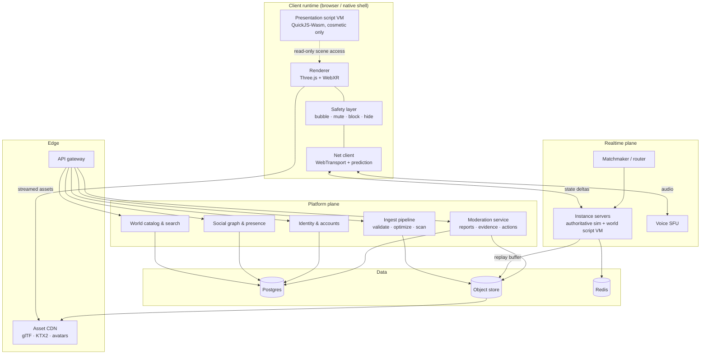

# 01 — System architecture

## 1.1 The client decision: WebXR-first

**Commit: the runtime is a web runtime.** Three.js (via React Three Fiber for the 2D
UI shell and scene composition) + `@react-three/xr` / raw WebXR Device API for
session management. Ships to Quest 3/3S (Meta Browser, Wolvic), Vision Pro (Safari
WebXR), Pico, desktop browsers, and phone AR (WebXR on Android; iOS via a fallback
camera+ARKit path in the native shell).

### Why this beats Unity for *this* product

The deciding constraint is not rendering quality. It is this: **a UGC platform
downloads and executes untrusted content at runtime.** That single requirement
inverts the usual engine comparison.

| Constraint | WebXR runtime | Unity |
|---|---|---|
| Runtime-downloaded content | Native capability. Assets and sandboxed scripts stream in like any web resource. | Fights the platform: AssetBundles for content, but store rules restrict downloaded executable code; you end up shipping a custom scripting VM anyway. |
| Store policy risk | None for the web build. | Real. UGC apps get rejected, age-gated, and re-reviewed on every content policy shift. |
| Iteration speed | Push to CDN. No store review on the critical path. | Store review on the critical path for every client fix. |
| Link-to-join / virality | A world is a URL. Click → you are in it, no install. | Install wall in front of every share. Kills the empty-room fix. |
| Raw perf ceiling | Lower. ~2–3× overhead vs. native on draw-call-heavy scenes. | Higher. |
| Mature XR tooling | Thinner. You build more of the toolchain. | Deep. |

The perf gap is real and you pay for it. You pay it *knowingly* because the sharing
loop and the sandbox are the product, and both are native to the web and hostile to
the store model. Every big UGC platform (VRChat, Rec Room, Resonite) independently
reinvented a sandboxed scripting VM and an asset streaming layer on top of a native
engine, at enormous cost. Starting on a platform where those are free is the leverage.

**The native shell (phase 3):** a thin wrapper app that embeds the same runtime for
store presence, push notifications, iOS ARKit access, and better thread/memory
headroom. It hosts the identical world runtime — it is a distribution channel, not a
second codebase. Reject any proposal that forks world logic into the shell.

**What would change this decision:** if a spike shows a 60-avatar instance with
typical UGC content cannot hold 72 fps on Quest 3 in the browser even after the LOD
and instancing work in [03](03-ugc-pipeline.md), the calculus flips toward a native
runtime with a Wasm script layer. Run that spike in phase 0. It is the single most
important number in the project.

## 1.2 Service topology



### Plane responsibilities

**Realtime plane** — stateful, latency-critical, scales by instance count. Instance
servers are the only component that runs untrusted authoritative code, so they are
the tightest security boundary in the system. Written in Rust: you need
deterministic memory behavior, no GC pauses inside a 20 Hz tick, and first-class
Wasmtime embedding for the script sandbox.

**Platform plane** — stateless request/response, scales horizontally, boring on
purpose. Any language; a single Node/TypeScript service mesh is fine and keeps the
SDK, the editor, and the backend in one type system. Share the world-schema types
between server and client via a generated package — schema drift between the editor
and the runtime is a top-3 source of "my world broke" reports.

**Ingest pipeline** — async job workers. The most load-bearing platform service and
the one teams consistently under-resource. See [03](03-ugc-pipeline.md).

### Data placement

| Data | Store | Notes |
|---|---|---|
| Accounts, entitlements, world catalog, social graph | Postgres | Single primary + read replicas is sufficient far past your first million users. Do not shard early. |
| World assets, avatar bundles, replay buffers | S3-compatible object store, CDN-fronted | Content-addressed keys (hash of bundle) → immutable, infinitely cacheable, trivially rollback-able. |
| Presence, instance registry, matchmaking, rate limits | Redis | Ephemeral by design. Losing it should degrade routing, never lose durable state. |
| Live instance state | Instance server memory, snapshotted to object store | Snapshot cadence per world's persistence tier ([02](02-netcode.md) §2.7). |
| Analytics / telemetry | Columnar warehouse (ClickHouse or managed equivalent) | Creator analytics is a phase-2 product surface, not just internal ops. |

## 1.3 The world graph model

A **world** is a versioned, immutable bundle. An **instance** is a running copy of a
world with people in it. This separation is non-negotiable — it is what makes
rollback, moderation takedown, and A/B routing possible.

```
World (catalog entity, mutable pointer)
  └── WorldVersion (immutable, content-addressed)
        ├── scene graph        — entity tree, transforms, components
        ├── asset manifest     — hashed refs to meshes, textures, audio
        ├── authoritative script bundle  — Wasm, runs on instance server
        ├── presentation script bundle   — Wasm, runs on clients
        ├── capability manifest — declared permissions (see 03 §3.6)
        └── budget report      — measured tri/texture/script costs at ingest
```

**Entity-component model, data-oriented.** Entities are IDs; components are typed
data in contiguous arrays. Scripts see entities through a handle API, never raw
pointers into the scene. Two reasons: (a) the network layer serializes component
arrays directly, and (b) a handle API is the only way to make the sandbox boundary
enforceable per-field.

Core component set — deliberately small, because every component is forever:

- `Transform` (position, rotation, scale), `Parent`
- `Renderable` (mesh + material refs, LOD group)
- `Collider`, `RigidBody` (physics is opt-in per entity)
- `Interactable` (grab, click, hover — the standard affordance set)
- `Seat`, `Portal`, `SpawnPoint`, `Zone` (the primitives every social world needs)
- `Networked` (replication policy: owner, rate, priority)
- `AudioSource` (spatialized), `MediaSurface` (video/web panel, capability-gated)
- `ScriptBehavior` (binds an entity to a sandboxed script instance)

Everything else creators build from these. Resist the urge to ship 60 components in
year one; ship 15 good ones and a scripting API that composes them.

## 1.4 AR mode

AR is the *same world graph* rendered under different assumptions. Three modes, one
runtime:

| Mode | Presentation | Anchoring | Ships |
|---|---|---|---|
| **Immersive VR** | Full environment, room-scale | World origin = play space origin | Phase 1 |
| **Passthrough / mixed** | World's `Zone`s tagged `ar-safe` render; environment mesh suppressed | Single local anchor, user-placed | Phase 2 |
| **Shared-space AR** | Multiple co-located users see the same content in the same physical place | Shared anchor, cross-device aligned | Phase 3 |

**Creators opt in per-zone.** A world declares which zones are AR-presentable and
what its "tabletop scale" transform is. Do not attempt automatic VR→AR conversion;
it produces garbage and creators blame the platform.

**Colocation, in order of increasing cost:**

1. **Marker alignment** (phase 3a) — a printed or on-screen QR/image target defines a
   shared origin. Ugly, works everywhere, ~2 weeks of work. Ship this first.
2. **WebXR anchors + relocalization** (phase 3b) — persistent per-device anchors;
   cross-device alignment via a shared feature map where the platform exposes one.
3. **Cloud anchors** (phase 4, if ever) — vendor-specific, fragmenting, expensive.
   Only justified if colocated AR becomes a top-3 use case in telemetry.

**iOS reality check.** Safari's WebXR AR support has historically lagged; the phone-AR
path on iOS routes through the native shell with ARKit, sharing the world graph but
not the WebXR session code. Budget that as a real, separate integration — it is the
main thing pulling the native shell forward from phase 3 into phase 2.

## 1.5 Explicitly rejected

| Rejected | Why |
|---|---|
| **Peer-to-peer mesh (no instance server)** | Cheap until you need authority, moderation evidence, persistence, and anti-cheat — all of which UGC demands on day one. P2P is right for a 4-person tool, wrong for a public social platform. |
| **Blockchain / on-chain asset ownership** | Adds latency, cost, key-loss support burden, and regulatory surface; solves no problem this product has. Creator payouts are a payments problem, not a ledger problem. |
| **Custom engine** | Two to three years of runway spent rebuilding a renderer while the actual differentiators (pipeline, sandbox, moderation) go unbuilt. |
| **Per-world containers / VMs for isolation** | Correct-feeling, ~50–100 ms cold starts and 10× the memory floor per instance. The Wasm isolate gets the same isolation at ~1 ms and a few MB. Revisit only if the sandbox proves inadequate. |
| **Generic game-backend BaaS for the realtime plane** | The authority model here is unusual (untrusted server-side scripts). You will fight the abstraction within a quarter. Buy the SFU; build the instance server. |
| **Photorealism as a differentiator** | Perf budget on standalone headsets makes it unwinnable, and stylized worlds age better and are cheaper for creators to make. |
