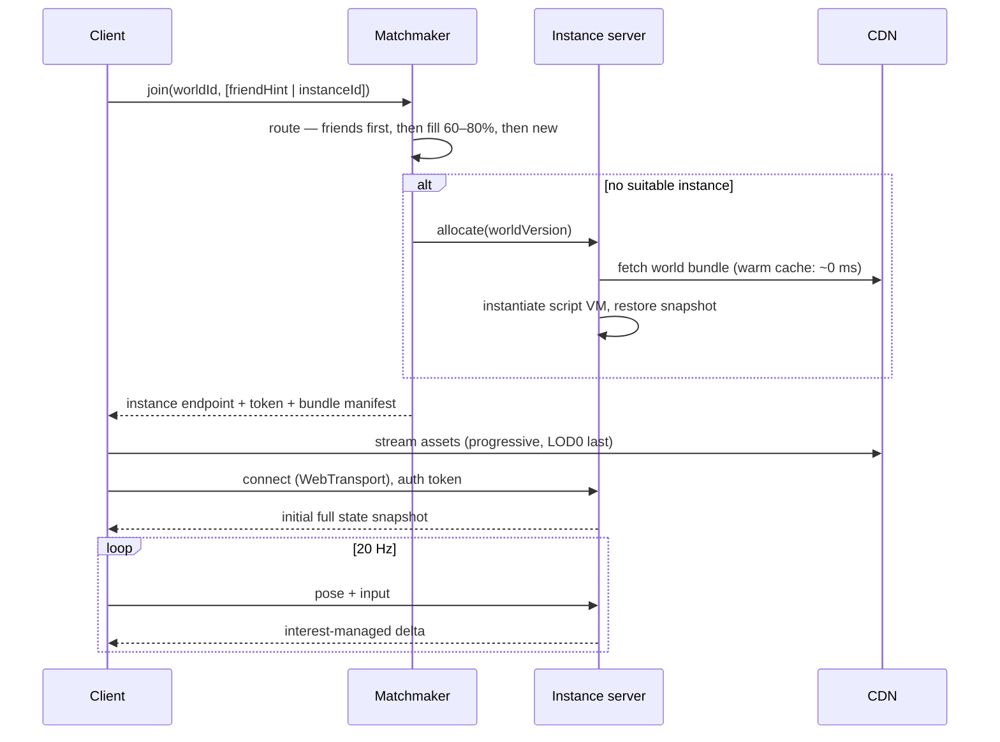

# 02 — Netcode & realtime

## 2.1 Authority model

The rule that makes UGC survivable: **anything a world script can change is
server-authoritative; anything only a human body drives is client-authoritative with
server validation.**

| State | Authority | Rationale |
|---|---|---|
| Head + hand + body pose | Client, server-validated | Tracking data originates on-device; round-tripping it adds unforgivable latency to your own avatar. Server clamps speed, teleport distance, and rate. |
| Voice | Client → SFU | Server never decodes audio in the hot path (see §2.6). |
| Grabbed-object transform | **Transferable client authority** | Holding an object must feel instant. The server grants an exclusive ownership lease; the holder streams the transform; the server clamps and can revoke. |
| Physics simulation | Server, for `Networked` bodies | Divergent client physics is the classic source of "the ball is in a different place for everyone." Non-networked decoration physics runs client-side and is allowed to diverge. |
| World script state (scores, doors, spawns, inventory) | Server | This is the exploit surface. Never trust a client assertion about world state. |
| Cosmetic/presentation state (particles, idle anims, shader params) | Client | Free to diverge. Most UGC "logic" lives here — deliberately. |

**Ownership leases** are the mechanism, not ad-hoc rules: a client requests authority
over an entity, the server grants a lease with a TTL and a validation policy, and
revokes on timeout, disconnect, or policy violation. One mechanism covers grabbing,
seats, vehicles, and tools. Get this right in phase 1 and creators build things you
never anticipated on top of it.

## 2.2 Transport

**Primary: WebTransport over HTTP/3.** Gives you what real-time 3D needs and
WebSockets cannot: unreliable, unordered datagrams alongside reliable streams over a
single connection, with no head-of-line blocking. State snapshots go on datagrams;
events, RPCs, and ownership negotiation go on reliable streams.

**Fallback: WebRTC DataChannel** (unreliable mode) for runtimes without WebTransport,
tunnelled to the instance server through a lightweight ingress. Expect to maintain
both through at least phase 2; do not let the fallback dictate the primary design.

**Never: WebSockets for state.** A single lost packet stalls the whole stream. Fine
for the lobby, the chat channel, and control-plane messages — not for 20 Hz pose data.

**Wire format:** hand-rolled binary, bit-packed, schema-generated from the component
definitions. Quantize aggressively:

- Position: 16-bit per axis over the instance's bounded volume (~1 mm precision in a
  64 m room)
- Rotation: smallest-three quaternion, 32 bits total
- Velocity: 8-bit per axis, only when it changes prediction meaningfully

Per-avatar delta ≈ 40–60 bytes for head + two hands + a handful of tracked joints.
Do not use JSON, Protobuf, or FlatBuffers on the hot path — the schema flexibility
costs 3–5× bandwidth and you control both ends. Use whatever you like on the reliable
channel, where message volume is two orders of magnitude lower.

## 2.3 Tick and rate budget

| Loop | Rate | Notes |
|---|---|---|
| Server sim tick | 20 Hz (50 ms) | Enough for social presence. 60 Hz is a competitive-shooter budget you do not need and cannot afford at your instance density. |
| Client render | 72–90 Hz | Headset-native; decoupled from sim via interpolation. |
| Pose upload | 20 Hz, adaptive down to 10 Hz | Adaptive on uplink pressure. |
| State broadcast | 20 Hz for near, 10 Hz mid, 2–5 Hz far | Interest-managed, see §2.4. |
| Script tick | 10 Hz default, 20 Hz opt-in with budget cost | Most world logic does not need per-tick resolution. |

**Client-side smoothing, not client-side prediction, for remote avatars.** Remote
avatars are interpolated on a ~100 ms delay buffer. Prediction/extrapolation on human
motion produces the "rubber-band limbs" that makes social VR feel wrong. Predict only
your own avatar (zero-latency local rendering) and held objects.

**Bandwidth target:** ≤ 150 kbps down and ≤ 60 kbps up per client at 30 nearby
avatars, excluding voice and asset streaming. If a spike shows you materially over
this on real UGC content, the interest management is wrong, not the codec.

## 2.4 Interest management

Naive N² broadcast dies around 15–20 avatars. Three mechanisms, all needed:

1. **Spatial grid + priority queue.** Each client gets a per-tick byte budget. Fill it
   from a priority queue scored by distance, whether the entity is in the view
   frustum, recency of change, and whether the client is currently interacting with
   it. Everything else waits for a later tick. This degrades gracefully: a crowded
   instance loses update *frequency* on distant avatars, never correctness.
2. **Zones as authored interest boundaries.** Creators mark `Zone` entities; entities
   in a zone you are not in and cannot see replicate at the floor rate or not at all.
   Cheap, creator-controlled, and it teaches good world design.
3. **Avatar LOD in the network layer, not just the renderer.** Beyond ~8 m, drop
   finger joints; beyond ~20 m, send head + root only. Network LOD and visual LOD
   ([04](04-avatars-identity.md) §4.3) must be driven by the same distance bands or
   you get avatars that pop between fidelity tiers.

## 2.5 Instance lifecycle

**Routing policy is a product feature, not plumbing.** In priority order: put people
with friends already in-world into that instance; else fill an instance to 60–80% of
capacity (populated but not overwhelming); else spin up new. Never distribute users
evenly across instances — that is the empty-room problem implemented as an algorithm.

**Instance sizing:** soft cap 40 concurrent users, hard cap 60, per-world overridable
downward. Above ~40 the social experience degrades (voice becomes noise) before the
tech does. For larger gatherings, use one instance with *audience* clients — receive-only,
no avatar replication upward, imposter-rendered crowd — rather than raising the cap.

**Drain and migrate:** instances must survive a deploy. Snapshot → new process →
clients reconnect with a resume token → restore. Target < 2 s of visible disruption.
Design this in phase 1; retrofitting it means every deploy dumps every user, which
means you stop deploying.

## 2.6 Voice

**Buy an SFU** (LiveKit, mediasoup, or managed equivalent). Do not build one; do not
mix audio server-side.

- Opus, 24 kbps mono, 20 ms frames.
- **Spatialization happens on the client** via the Web Audio API — the SFU forwards
  discrete streams and the client positions them. Server-side mixing would force
  per-listener mixes (O(N²) CPU) and destroy spatial fidelity.
- **Subscription is interest-managed** the same way state is: subscribe to the ~12
  nearest/loudest speakers, plus anyone in your party regardless of distance.
- **Client-side safety is applied before playback and cannot be bypassed by world
  scripts** — mute, block, and the personal bubble's audio falloff are enforced in the
  client audio graph ([05](05-trust-safety.md) §5.2).
- **Ring buffer:** the SFU retains the last 60–120 s of per-speaker audio in memory
  for report evidence, dropped otherwise (§2.8).

## 2.7 Persistence tiers

Not all worlds need the same durability, and paying for the strictest tier everywhere
is how the cost model breaks.

| Tier | Semantics | Snapshot | Use |
|---|---|---|---|
| **Ephemeral** | State dies with the instance | none | Hangouts, games, most worlds |
| **Session** | Survives instance restart/migration | every 30 s + on drain | Long-form games, events |
| **Durable** | Survives across all instances, shared globally | write-through to Postgres for declared persistent fields | Player homes, persistent economies, saved builds |

Durable state costs real money and real complexity (conflict resolution across
instances). Gate it: creators opt in per-field with a declared schema, and there is a
hard cap on durable bytes per world per user. Otherwise the first creator who
persists a transform every tick takes down your database.

## 2.8 Evidence capture (designed in, not bolted on)

Every instance keeps a rolling buffer of the last 3–5 minutes of state deltas plus
the SFU's audio ring. On a report, the buffer is frozen and written to object store
with the reporter's timestamp; otherwise it is discarded. Retention on frozen
evidence: 90 days, then deleted.

This costs ~5–15 MB of memory per instance and is the difference between a moderation
team that can act and one that cannot. It is impossible to add later without
re-architecting the state channel — which is precisely why it appears in the netcode
document and not only in [05](05-trust-safety.md).
