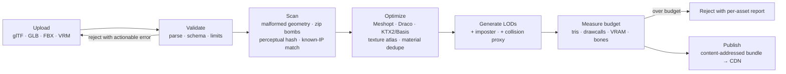

# 03 — The UGC pipeline

This is the product. Everything else is infrastructure supporting it.

## 3.1 The creator ladder

The failure mode of every UGC platform is a cliff between "I placed a cube" and "I
shipped something people return to." Design the ladder explicitly, and staff each rung:

| Rung | Surface | Time to first result | Ships |
|---|---|---|---|
| **0 — Decorate** | In-world: place, move, scale, recolor items from a platform kit | < 60 s | Phase 1 |
| **1 — Assemble** | In-world: kitbash a room from primitives + kit, set spawn points, publish | ~15 min | Phase 1 |
| **2 — Wire** | Visual logic: trigger → action graphs (button opens door, zone plays sound) | ~1 h | Phase 2 |
| **3 — Import** | Bring your own glTF/Blender assets through the web uploader | ~1 h | Phase 2 |
| **4 — Script** | TypeScript SDK, local dev loop, `loom dev` hot-reload against a private instance | days | Phase 2/3 |

**Rung 2 is the one teams skip and the one that decides whether a long tail forms.**
Most creators will never write TypeScript, but "when someone sits here, the lights
change" is the difference between a static room and a place. A trigger→action graph
that compiles down to the *same* script bytecode as rung 4 (§3.5) means one runtime,
one security model, two authoring surfaces.

**In-world building is not optional.** The ability to build while your friends watch
is a social loop, not just a convenience — it is how creation spreads. But do not
build a full IDE in VR: in-world for layout and iteration, browser-based for asset
import, scripting, and publishing.

## 3.2 Asset ingest



**Non-negotiables:**

- **glTF 2.0 is the only runtime format.** Everything converts at ingest. One format
  in the renderer means one code path for LOD, one for materials, one for animation.
- **Optimization is the platform's job.** Creators will not hand-author LODs, atlas
  textures, or pick compression settings. Automate all of it (Meshopt for geometry,
  KTX2/Basis Universal for textures, automated decimation for the LOD ladder). A
  creator who has to learn draw-call batching to publish is a creator you lost.
- **Reject at ingest, never at runtime.** A budget violation must produce a specific,
  fixable error message ("Chair_03.glb: 184k triangles, limit 40k — try the auto-decimate
  option") at upload time. Runtime degradation is invisible to the creator and
  therefore never gets fixed.
- **Content-addressed output.** Bundle key = hash of contents. Immutable, cacheable
  forever, deduped across worlds, and instantly revertible.

**Throughput note:** ingest is bursty and CPU-heavy (decimation and Basis encoding
are the expensive steps). Run it as an autoscaling worker pool with a queue, target
p95 < 90 s for a typical world bundle, and show the creator real progress. A silent
5-minute upload feels broken.

## 3.3 Budgets

Published as public, versioned numbers. Enforced mechanically at ingest.

| Budget | Standalone headset target | Notes |
|---|---|---|
| Triangles rendered / frame | ≤ 350k | Includes avatars; world gets ~200k |
| Draw calls / frame | ≤ 150 | The real killer on mobile GPUs. Atlas + instance at ingest. |
| Texture VRAM / world | ≤ 192 MB after KTX2 | |
| Unique materials / world | ≤ 60 | |
| Realtime lights | ≤ 2 + baked | Bake at ingest where the scene is static |
| World bundle size | ≤ 120 MB | Time-to-first-frame is a retention metric |
| Script instructions / tick / world | fuel-metered, ~2 ms of budget | §3.5 |
| Networked entities / instance | ≤ 512 | Beyond this, interest management stops saving you |

**Time-to-playable is the metric that actually matters**, not bundle size. Target
< 8 s on a warm CDN to *walkable* state via progressive loading: collision + spawn
area + LOD2 geometry first, textures and detail streaming in after the user is
already standing in the world. Users forgive a world that sharpens; they do not
forgive a loading bar.

## 3.4 The script sandbox — threat model first

Untrusted code is the defining risk. Assume every world script is hostile and
authored by someone competent. It must be unable to:

| Threat | Mitigation |
|---|---|
| Hang or crash the instance (infinite loop, allocation bomb) | Wasm **fuel metering** — the VM traps at a hard instruction budget per tick — plus a hard linear-memory cap. Overrun → script suspended, world flagged, instance survives. |
| Read or write another world's state | One isolate per world instance, no shared memory, no ambient handles. |
| Reach the network or filesystem | The Wasm module has **no imports** except the host API. There is no socket to reach. This is why Wasm beats a JS `iframe`/worker sandbox: the capability surface is empty by construction. |
| Deanonymize or track users | The API exposes opaque per-world-scoped user IDs, never platform IDs, never IP, never device info. Same human in two worlds = two unlinkable IDs. |
| Trap the user (block exit, force teleport, disable menu) | Locomotion and menu are client-owned and **below** the script layer. Scripts *request* teleports; the client may refuse. See [05](05-trust-safety.md) §5.2. |
| Harass through presentation (strobe, ear-rape, screen-fill) | Client-enforced caps: audio gain ceiling, flash-frequency limiter, no full-FOV opaque overlay from world scripts. Enforced in the renderer/audio graph, not requested politely. |
| Exfiltrate via covert channel (timing, asset-fetch patterns) | Coarse timers only (no `performance.now()` precision), asset fetches go through the manifest, not arbitrary URLs. Accept residual low-bandwidth risk. |
| Grief the physics sim to melt CPU | Physics body count and spawn rate are quota'd per world; spawn calls fail rather than queue. |

**The runtime: QuickJS compiled to Wasm, embedded in Wasmtime** (server) and the
browser's own Wasm engine (client).

Why this shape:
- Creators author TypeScript — the language they already know, with types generated
  from the component schema.
- QuickJS-in-Wasm gives you a JS engine you fully control: deterministic, no JIT
  surprises, fuel-metered, memory-capped, zero ambient authority.
- Cold start ~1 ms and a few MB per isolate, so a single instance server can host
  many worlds' scripts. Containers or per-world processes give the same isolation at
  50–100× the cost ([01](01-architecture.md) §1.5).
- Advanced creators can ship Rust/AssemblyScript → Wasm directly, bypassing QuickJS,
  through the identical host API. One security boundary, two authoring paths.

**Server-side JIT is a liability, not a feature.** You are running adversarial code;
predictability beats throughput. If a world genuinely needs more compute than the
fuel budget allows, that is a signal to move the work client-side (§3.5), not to
raise the budget.

## 3.5 Split logic: authoritative vs. presentation

Every world compiles to **two** script bundles from one source tree:

| | Authoritative | Presentation |
|---|---|---|
| Runs on | Instance server | Every client |
| Owns | Game state, spawns, scoring, ownership, persistence | Particles, tweens, idle animation, shader params, local UI |
| Trust | Server-trusted output; scales with instance count | Untrusted, unverified; scales for free |
| Budget | Fuel-metered, ~2 ms/tick shared across worlds on the node | Frame-budget-metered on client |
| Cheating | Impossible — clients only observe | Irrelevant — nothing here is authoritative |

Creators mark functions `@authoritative` or leave them client-side (the default). The
compiler enforces the boundary: presentation code that tries to mutate networked
state fails to compile with a message explaining why.

**This is a cost-model decision as much as a security one.** If all world logic ran on
the server, your per-CCU cost would be dominated by other people's inefficient
scripts, and it would be unbounded. Pushing cosmetic logic — which is the large
majority of it — to clients keeps server cost predictable ([06](06-scale-and-cost.md)).

## 3.6 Capability manifest

A world declares what it needs; the platform prompts once and enforces always. Absent
declarations are denied by default.

```jsonc
{
  "capabilities": {
    "persistence": { "durable": false, "sessionBytes": 65536 },
    "media": { "video": ["approved-cdn-host"], "webPanel": false },
    "physics": { "maxBodies": 128, "maxSpawnPerSec": 20 },
    "audio": { "maxSources": 24, "maxGainDb": 0 },
    "avatarRead": "none",          // none | shape | full — gated, audited
    "externalLinks": ["example.com"], // shown to user before navigation, always
    "scriptTickHz": 10
  }
}
```

Capabilities appear in the world's listing before a user enters, are diffed on every
version publish, and re-prompt on escalation. `avatarRead: full` and `webPanel: true`
are review-gated, not self-serve — they are the two most abusable capabilities in the
set.

## 3.7 Publishing, versioning, rollback

- **Every publish creates an immutable `WorldVersion`.** The world entity is a mutable
  pointer to one of them.
- **Channels:** `draft` (creator only) → `preview` (link-holders, no discovery) →
  `live`. Promotion is a pointer move, so it is instant and instantly reversible.
- **Running instances are not force-migrated on publish.** New joiners get the new
  version; existing instances finish on the old one. Version pinning per instance
  avoids the "the world changed under my feet mid-game" bug class.
- **Rollback is a single pointer move** and must be available to both the creator and
  the moderation team. Content-addressed bundles make this free.
- **Forking/remixing:** a first-class operation with attribution recorded in the
  catalog, opt-out per world. Remixability is the strongest known accelerant for a UGC
  long tail — treat opt-in-by-default as a product decision, not a legal afterthought,
  and pair it with a clear license selection at publish ([05](05-trust-safety.md) §5.6).

## 3.8 Creator SDK and local loop

```
loom init my-world          # scaffold: scene, TS entry, types generated from schema
loom dev                    # local runtime + private instance, hot-reload on save
loom check                  # budgets, capability diff, script lint, perf estimate
loom publish --channel=preview
```

`loom check` running in CI-equivalent form *before* upload is what keeps ingest
rejections rare and non-infuriating. The same checks run server-side (never trust the
client), but a creator should almost never be surprised by a server-side rejection.

**Hot-reload against a live instance with friends in it** is the single most
motivating creator feature you can ship. Prioritize it above visual polish in the
editor.
