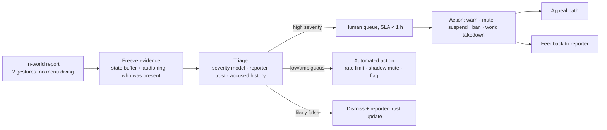

# 05 — Trust & safety

Treat this as a systems-engineering document, not a policy document. On a UGC social
platform, safety is enforced by architecture or it is not enforced.

## 5.1 Threat model

| Vector | Actor | Severity | Primary control |
|---|---|---|---|
| Voice harassment, slurs, sexual content | User | Very high — the #1 report category in every social VR platform | Client-side mute/block, personal bubble, evidence capture, trust tiers |
| Personal-space violation, groping gestures | User | Very high, disproportionately affects women and minors | Personal bubble as a client primitive (§5.2) |
| Malicious world content (shock imagery, strobe, ear-rape) | Creator | High | Ingest scanning, client-enforced sensory caps, capability manifest |
| Malicious world scripts (crash, trap, deanonymize) | Creator | High | Wasm sandbox ([03](03-ugc-pipeline.md) §3.4) |
| IP infringement (ripped models, ripped avatars) | Creator | High — existential legally, and it is *rampant* in this category | Perceptual hashing at ingest, DMCA pipeline, creator attestation |
| CSAM / illegal content | Bad actor | Existential | Hash matching at ingest, mandatory reporting pipeline, law-enforcement process |
| Minors in adult spaces | Structural | Existential | Age bands wired into discovery, matchmaking, and voice routing |
| Ban evasion | User | Medium, compounding | Device + payment signals, trust tiers, re-earn model |
| Instance griefing (spawn spam, physics flood) | User/creator | Medium | Quotas, ownership leases, rate limits |
| Scams, off-platform grooming | User | High | Link interstitials, DM restrictions by age band and trust tier |

## 5.2 Safety primitives live below the script layer

**Architecture, not policy.** These are enforced in the client's renderer, audio
graph, and input layer — *beneath* both world scripts and other users' influence.
World code cannot see them, override them, or detect them.

| Primitive | Guarantee |
|---|---|
| **Personal bubble** | Configurable radius (default 0.6 m). Other avatars fade and their colliders stop resolving against yours inside it. Audio attenuates. Non-defeatable. |
| **Mute / block** | Applied in the local audio graph and renderer before world code runs. A blocked user is invisible and inaudible to you and you to them, in every world, forever, with no signal to them. |
| **Exit** | The platform menu and "return home" are always reachable via a reserved input gesture. No script can capture it, occlude it, or delay it. |
| **Locomotion ownership** | Scripts *request* teleports/attachments; the client may refuse. Motion-sickness settings (snap turn, vignette, comfort mode) are user-owned and cannot be overridden. |
| **Sensory caps** | Hard client limits on audio gain, flash frequency (photosensitivity), and full-FOV opaque overlays, regardless of what the world asks for. |
| **Panic action** | One gesture → instant safe-mode: all remote avatars to grey imposters, all non-friend audio muted, ready to leave. Ship this in phase 1. |

If a proposed feature requires weakening any row of this table, the answer is no. The
cost of that discipline is a few genuinely cool world mechanics; the cost of not
having it is your platform's reputation, permanently.

## 5.3 The moderation loop

**The parts teams get wrong:**

- **Reporting must be in-world and take under three seconds.** If a user has to leave
  the instance, remember a username, and fill a web form, they will not report — and
  your data on abuse will be wrong by an order of magnitude, which means your
  prioritization will be wrong too.
- **Evidence must be automatic.** Captured at report time from the buffer designed in
  [02](02-netcode.md) §2.8. Retrofitting this is architecturally expensive; that is
  why it is a netcode requirement.
- **Close the loop with the reporter.** "We reviewed this and took action" (without
  details) is the difference between a reporting culture and a resigned one.
- **Reporter trust is a real signal.** Weight reports by the reporter's history.
  Mass-report brigading is a predictable attack.
- **Appeals are a product surface.** Wrong bans are guaranteed at scale; a broken
  appeal path converts an error into a permanent detractor and, eventually, a story.

## 5.4 Trust tiers

Capability grows with demonstrated history — the mechanism that makes ban evasion
expensive without making onboarding hostile.

| Tier | Earn | Grants |
|---|---|---|
| Guest | Click a link | Enter public worlds, local voice, no persistence, visibly marked |
| New | Verified account | Save avatar, add friends, publish to `preview` |
| Established | ~10 h in-world, no upheld reports | Publish `live`, upload custom avatar/assets, DM |
| Trusted | Sustained clean history, some reviewed content | Higher budgets, faster review queue, `webPanel`-class capabilities |
| Creator-verified | Manual review + identity/payout verification | Monetization, featured discovery eligibility |

Ban evasion becomes "spend 10 hours re-earning it," repeatedly. Not perfect —
sufficient.

## 5.5 Ingest-side content safety

Runs on every upload, before publish:

- **Hash matching** against known-illegal-content databases (industry-standard hash
  sets) on all images and textures — non-negotiable, and a legal obligation in several
  jurisdictions.
- **Perceptual hashing** against a corpus of known commercial/game assets to catch
  ripped models. Not conclusive on its own; routes to human review, not auto-reject.
- **Classifier pass** on textures and thumbnails for adult/violent content → drives
  the world's content rating rather than a binary reject.
- **Creator attestation** at publish: an explicit ownership/licensing declaration,
  logged with the version. This is what makes your DMCA safe-harbor posture defensible.
- **Structural validation**: decompression bombs, malformed accessors, absurd bone
  counts, degenerate meshes — reject at parse.

## 5.6 Creator IP, licensing, remixing

Two obligations pulling in opposite directions: enabling remixing (which grows the
long tail) and protecting creators (which retains them).

- **Explicit license selection at publish** — All Rights Reserved / remixable with
  attribution / public-domain-equivalent. Default to remixable-with-attribution for
  worlds and All Rights Reserved for avatars; those defaults match creator
  expectations in this space.
- **Attribution is structural.** Forks record lineage in the catalog and display it.
- **DMCA pipeline** with counter-notice, staffed and documented before you have your
  first million users, not after your first lawsuit.
- **Takedown = pointer move** ([03](03-ugc-pipeline.md) §3.7), so it is instant and
  reversible if a claim fails.

## 5.7 Privacy

- **Body motion is biometric-adjacent.** Head and hand motion traces are identifying
  with high accuracy in published research. Treat pose telemetry as sensitive personal
  data: minimize retention, never sell it, disclose it plainly, and keep it out of
  third-party analytics.
- **Voice audio is retained only in the rolling ring buffer** and only persisted when
  a report freezes it. Say this clearly in the product, not just the policy.
- **World scripts get opaque per-world IDs and nothing else** ([04](04-avatars-identity.md) §4.5).
- **Face/eye tracking data never leaves the device as imagery** — only derived
  blendshape weights.
- **Minors' data** attracts a stricter regime everywhere you will operate. The age
  band signal from §5.4 must gate telemetry collection too, not just content access.
