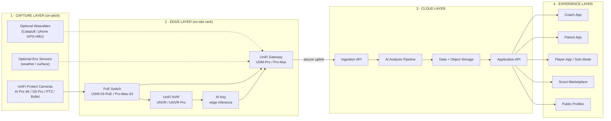

# Athletes Insights Platform — Technical Architecture Overview

**Audience:** Full-stack team — network/install engineers through cloud/AI/app engineers
**Level:** High-level architecture + data flow (overview, not implementation-ready)
**Version:** v4.0 — grounded in the verified UniFi (ui.com/ca/en) hardware stack
**Status:** Reference architecture for the three-package deployment model (Starter / Growth / Pro)

> Source reference, committed so the codebase owns the infrastructure definition.
> The machine-readable form lives in `openpitch/hardware.py`; the prototype's
> mapping onto these layers is in `ARCHITECTURE.md`.

This document explains how the system works end-to-end: from a camera mounted on a pitch, through the on-site UniFi stack, up to the cloud AI pipeline, and out to the coach/parent/player apps. It is deliberately high-level — enough for any engineer to understand their piece and how it connects, without prescribing exact configs.

---

## 1. System at a Glance

The platform is a **four-layer pipeline**: Capture → Edge → Cloud → Experience.

**The core idea:** Cameras capture, the on-site UniFi stack records and pre-processes (including edge AI), then footage and metadata sync to the cloud where the heavy AI analysis runs, and results surface through the apps.

---

## 2. Layer 1 — Capture (On-Pitch Hardware)

### 2.1 What's deployed (by package)

| Component | Starter (5-a-side) | Growth (7-a-side) | Pro (11-a-side) | Role |
|---|:---:|:---:|:---:|---|
| Camera AI Pro 4K (UVC-AI-Pro) | 1 | 1 | 1 | Tactical wide-angle; primary analysis feed |
| Camera G5 PTZ (UVC-G5-PTZ) | 1 | 1 | 1 | Auto-tracking; player close-ups |
| Camera G5 Pro 4K (UVC-G5-Pro) | 0 | 1 | 2 | Sideline multi-angle |
| Camera G5 Bullet (UVC-G5-Bullet) | 1 | 1 | 1 | Endline |
| U7 Pro Outdoor AP (U7-Pro-Outdoor) | 1 | 1 | 2 | Pitch-side WiFi 7 — weatherproof PoE+ backhaul for cameras + sync agent |
| Indoor AP (U7-Pro) | 0 | 1 | 1 | Clubhouse WiFi |

### 2.2 How cameras connect

All cameras are **PoE (Power over Ethernet)** — a single Cat6 cable carries both power and data to each camera from the switch. No separate power runs.

**Install-engineer notes:**
- Cameras mount on poles/masts at elevation (4-6m) for optimal pitch angles. AI Pro goes center-elevated for the tactical wide view.
- Each camera needs one Cat6 run back to the switch (max 100m per run; use fiber + media converter beyond that).
- The PTZ camera needs clear sightlines down the full pitch length for tracking.
- Outdoor APs mount pitch-side for coach-tablet and player-phone connectivity.

### 2.3 Optional capture modalities

- **Wearables** (Premium upsell): Catapult Vector or phone-based GPS+IMU via the Player app. These sync over WiFi to the gateway, not through the camera path.
- **Environmental sensors** (Premium upsell): weather/surface sensors report to the gateway over WiFi/IoT protocols.

---

## 3. Layer 2 — Edge (On-Site Rack)

The on-site rack is the local brain. It records everything, runs first-pass AI, and manages the secure uplink to cloud.

### 3.1 Responsibilities of each edge device

| Device | Responsibility |
|---|---|
| **Gateway (UDM-Pro / Pro-Max)** | Routes all traffic; firewall/IDS; hosts UniFi Protect application; manages the secure cloud uplink; adopts and manages all UniFi devices on site |
| **PoE Switch** | Powers and connects cameras + APs; VLAN segmentation (cameras isolated from guest WiFi) |
| **NVR (UNVR / UNVR-Pro)** | Local-first recording of all camera feeds; RAID data protection (Pro tier); retains 30-60 days so footage survives any cloud outage |
| **AI Key** | Edge inference: runs detection (people, ball, events) locally at up to 1,800 events/hour so we don't ship raw 4K to cloud for first-pass detection |
| **Smart UPS** | Powers gateway + NVR through outages; triggers graceful NVR shutdown to prevent RAID corruption |

### 3.2 Why edge-first matters (key architectural decision)

**We record and pre-process locally, then sync — we do NOT stream raw 4K to the cloud in real time.**

1. **Bandwidth.** 5× 4K cameras streaming raw would need ~100+ Mbps sustained upload. Most academies don't have that. Edge recording + scheduled/event-driven sync solves it.
2. **Resilience.** If internet drops mid-session, recording continues locally. Nothing is lost.
3. **Cost.** Edge AI (AI Key) filters to *events of interest* before cloud processing, cutting cloud GPU cost dramatically.
4. **Privacy.** Raw footage of minors stays on-site by default; only processed clips + metadata go to cloud.

### 3.3 Network segmentation (VLANs)

Cameras live on an isolated VLAN (10) — they can reach the NVR and the sync service, nothing else. Management (20) holds NVR/AI Key/gateway. Coach/Staff WiFi (30) and Guest/Parent WiFi (40) are fully segregated from the camera and management networks.

---

## 4. Layer 3 — Cloud (Ingestion → AI → Storage → API)

### 4.1 The six AI pipeline stages

| Stage | Input | Output | Notes |
|---|---|---|---|
| **1 · Detection** | Synced clips | Per-frame player + ball positions | Pose estimation + multi-object tracking. Edge AI Key gives a head start on event candidates. |
| **2 · Event Detection** | Tracking data | Tagged events (pass, shot, tackle, etc.) | Temporal models over the tracking stream |
| **3 · Tactical Metrics** | Events + positions | xG, xT, xA, heatmaps, distance/speed | Writes positional/derived data to time-series store |
| **4 · Individual Reports** | Per-player events | Player performance breakdown | Feeds the coach/parent IDP narratives |
| **5 · Highlight Generation** | Events + clips | Auto-generated highlight reels | Shareable/viral content |
| **6 · Profile Update** | All of the above | Updated player profile records | The compounding data asset |

### 4.2 Processing model

- **Asynchronous, queue-driven.** A match upload creates a job; workers pull from the queue.
- **Quality tiers.** Footage graded (resolution, angle, stability) and routed to the right model path — phone Solo Mode gets a lighter pipeline than 4K facility footage.
- **GPU workers** for stages 1-2; CPU workers for stages 3-6.
- **Idempotent + resumable** — a failed stage re-runs without reprocessing the whole match.

### 4.3 Storage split

| Store | Holds | Why |
|---|---|---|
| **Relational DB** | Orgs, users, players, sessions, entitlements, profiles | Source of truth for structured records |
| **Time-Series Store** | Positional traces, event streams, metrics over time | Optimized for high-volume per-frame data |
| **Object Storage** | Raw clips (TTL), processed clips, highlights | Cheap blob storage; raw expires, processed retained |

---

## 5. Layer 4 — Experience (Apps & Surfaces)

### 5.1 Role-based access (critical for child safety)

| Role | Can see |
|---|---|
| **Coach** | Their org's players, sessions, full analysis |
| **Parent** | Only their own child's data + opt-in shareable highlights |
| **Player** | Their own profile + what they choose to make public |
| **Scout** | Only public-tier profile data + what a player/guardian explicitly unlocks |
| **Federation** | Aggregate/anonymized data + explicitly contracted orgs |

**Privacy default is private.** Public exposure is always opt-in and, for minors, guardian-gated.

### 5.2 Solo Mode (the consumer on-ramp)

Phone-only path that bypasses facility hardware: player phone records → upload to Ingestion API → lighter AI pipeline (phone-grade footage) → player profile update. Same cloud pipeline, lighter model path.

---

## 6. Child Safety & Privacy (Non-Negotiable Cross-Cutting Concern)

| Principle | Implementation |
|---|---|
| **Private by default** | No profile is public unless explicitly opted in |
| **Guardian-gated** | Any public exposure of a minor requires verified guardian consent |
| **Raw footage stays local** | Default retention of raw 4K is on-site NVR; cloud holds processed outputs + metadata |
| **Scout access is gated** | Scouts see only public-tier data; deeper access requires explicit player/guardian unlock per scout |
| **Audit trail** | Every access to a minor's data is logged and reviewable |
| **Data minimization** | Store derived metrics + highlights, not unbounded raw video |
| **Right to delete** | Profile + associated data deletable on request (cascades through stores) |

The Application API is the **single chokepoint** for all data access — authorization and audit logging enforced in exactly one place.

---

## 7. End-to-End Data Flow (One Match)

Cameras stream feeds (PoE) and the NVR records locally → AI Key flags events of interest → gateway syncs processed clips + event metadata (encrypted, post-session/scheduled) → Ingestion API enqueues a match job → pipeline runs detect → events → metrics → reports → highlights → writes to data stores → Application API serves results to apps (role-gated).

**Timeline:** match finishes → syncs post-session → processed within minutes to a couple of hours → results appear in apps. Not real-time during play (future roadmap with heavier edge compute).

---

## 8. Multi-Site / Multi-Pitch Topology

For academies with multiple pitches, each pitch is a capture cluster; one shared core rack (gateway + aggregation switch + NVR-Pro + AI Key + UPS) serves the site over a single secure uplink. Multi-pitch deployments are ~12-15% cheaper than the sum of standalone pitches because the central brain is shared.

---

## 9. Component Responsibility Matrix

| Layer | Owned by | Key deliverables |
|---|---|---|
| Capture | Install/network engineers | Camera mounting, PoE runs, AP placement, sightline calibration |
| Edge | Install/network engineers + platform | UniFi adoption, VLAN config, NVR setup, secure uplink, sync agent |
| Cloud — Ingestion | Backend/platform engineers | Ingestion API, auth, job queue, object storage lifecycle |
| Cloud — AI Pipeline | ML/AI engineers | Six-stage pipeline, model training, quality-tier routing, GPU orchestration |
| Cloud — Data/API | Backend engineers | DB schema, time-series store, Application API, authz + audit |
| Experience | App/frontend engineers | Coach/parent/player apps, Solo Mode, scout marketplace, public profiles |
| Cross-cutting | All + security lead | Child-safety enforcement, privacy defaults, audit logging |

---

## 10. Key Architectural Decisions

1. **Edge-first recording, cloud-heavy analysis.** Record local, sync processed. Don't stream raw 4K to cloud.
2. **UniFi as the standardized on-site stack.** One management plane across all hardware; cameras are PoE; gateway owns the secure uplink.
3. **AI Key does first-pass detection at the edge** to cut bandwidth and cloud GPU cost.
4. **Async queue-driven cloud pipeline** with six stages and quality-tier routing.
5. **Application API is the single authorization chokepoint** — child-safety and audit enforced there.
6. **Private-by-default, guardian-gated public exposure** for all minors.
7. **Solo Mode reuses the same cloud pipeline** with a lighter model path.
8. **Shared core rack for multi-pitch sites** — capture clusters per pitch, one brain per site.
